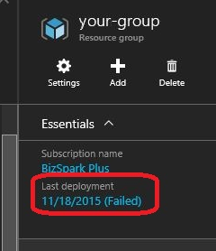

[Install the Unidesk ELM](get_started_deploy_unidesk_elm_co4)
 > Install the ELM
#Install the Unidesk Enterprise Layer Manager (ELM) with local storage (Azure)
In this article:
<table>            <col></col>            <tbody>                <tr>                    <td>                        
<a href="#Before"> Before you start</a>                        
                        
<a href="#Deploy_ELM"> Deploy the Unidesk ELM from the Azure Marketplace</a>                        
                        
<a href="#Next"> Next Step</a>                        
                    </td>                </tr>            </tbody>        </table>
##Before you start
To get started with Unidesk in Azure, you will need:
<ul>            <li>An Azure subscription</li>            <li>A Virtual Network in Azure. Your Unidesk deployment in Azure can operate in a point-to-site or site-to-site Virtual Network.</li>            
<b>Note:</b> If you have not already set up a connection to an Azure Virtual Network, see <a href="https://azure.microsoft.com/en-us/documentation/articles/?service=vpn-gateway">https://azure.microsoft.com/en-us/documentation/articles/?service=vpn-gateway</a> for more information.
            <li>The storage and Azure requirements listed <a href="get_started_prerequisites_az4.htm">here</a></li>        </ul>
##Deploy the Unidesk ELM from the Azure Marketplace
To deploy Unidesk for Azure, create a Virtual Machine in the Azure Marketplace using the Unidesk offering. This installs the Unidesk ELM with local storage for Unidesk Layers, Templates, and temporary files.
Using this procedure, you will do a basic Unidesk ELM installation in Azure. Once you complete these steps, use the following sections to change the administrator password (strongly recommended), and configure more advanced options, such as Static IP. 
<ol>            <li>                
Open a web browser, navigate to the <a href="https://portal.azure.com/">Microsoft Azure portal</a>, sign in with your Azure credentials, and click <b>New</b>.
            </li>            <li>In the search field in the New panel, type <b>Unidesk</b> and press <b>Enter</b>. The window displays Unidesk for Azure as a Publisher. Select it and click <b>Create</b>.</li>            <li>                
Fill out the Basics, Size, and Settings options for creating a new VM. 
            </li>            
<b>Notes:</b>            
            <ul>                <li>IMPORTANT: Record the User name and Password that you specify for the Azure VM for later use, as this becomes the User name and Password for the Administrator account of your Unidesk ELM. There is no root password on the ELM and if you lose the ELM credentials you will have to reinstall the ELM. You may also be asked to furnish the ELM credentials when you contact Unidesk Support. Note that the User name and Password for the ELM (which runs on Linux) is different from the User name and Password of the Unidesk Management Console (which runs on Windows).</li>                <li>IMPORTANT: Be sure to note the Resource group location you select now as you will require this information later. For more information about resource groups, refer to <a href="https://azure.microsoft.com/en-us/documentation/articles/resource-group-portal/">Using the Azure Portal to manage your Azure resources</a>.</li>                <li>When selecting a virtual machine size, Unidesk recommends creating an D3 Standard machine.</li>                <li>The name you specify for the new virtual machine must comply with Azure naming conventions.</li>                <li>Select a Virtual Network in which HTTP port: 80 is accessible (Public IP can be disabled).</li>                <li>On the Monitoring Diagnostics entry, select <b>Disabled</b>.</li>            </ul>        </ol>
To complete the process, view the Summary of the options you selected and, when you are satisfied with your selections, click OK, and click Purchase.
Note: If you experience a failed deployment of a Virtual Machine in Azure, you can obtain more detail regarding the nature of the failure by browsing to the relevant resource group and clicking the related "(Failed)" link.

##Configure advanced settings
Once you've completed the ELMinstallation, you should immediately log into the ELM and:
<ul>            <li>Modify the administrator password.</li>            <li>(Optional) Configure advanced network options, such as Static IP, as needed.</li>            <li>Make any changes required to the existing settings, for example, the NTP servers you use or the Time Zone.</li>        </ul>
The Unidesk Appliance Configuration utility lets you configure these settings. For details, click [ Manage the Unidesk ELM (virtual appliance) ](system_manage_appliance_co4)[.](system_manage_appliance_co4)
##Expand locally attached storage, if needed
If you need to expand the ELM's local storage, see [ Manage system storage](system_storage_co4)[. ](system_storage_co4)
##Next Step
Once you're satisfied that the ELM is correctly configured and has the required storage space, you can log into the Unidesk Management Console, and begin creating your layers.
[Log into the Unidesk Management Console (UMC)](get_started_login_az4)

