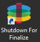

[App Layers](layer_apps_co4)
 > XenServer
#Create an App Layer (XenServer Connector)
In this article:
<table>            <col></col>            <tbody>                <tr>                    <td>                        
<a href="#Before"> Before you start</a>                        
                        
<a href="#Create2"> Prepare a new App Layer</a>                        
                        
<a href="#Install">Install the software on the Packaging Machine </a>                        
                        
<a href="#Finalize"> Finalize the Layer</a>                        
                        
<a href="#Create"> Reference: Create App Layer Wizard values</a>                        
                    </td>                </tr>            </tbody>        </table>
An App Layer is a bootable software image (virtual disk) containing one or more applications that you can use in any number of Layered Images. When publishing a Layered Image, you can combine an App Layer with the OS Layer used to create it, other App Layers, and a Platform Layer. 
To create an App Layer, you open the Create Layer wizard, deploy a Packaging Machine in your environment, then install the application(s). Once the application(s) are installed, you finalize the Layer.
A Packaging Machine is a VM where you install the application(s) that will be included in the Layer. Unidesk creates the Packaging Machine in the location and using the credentials you supply by choosing the Platform Target (hypervisor) and selecting a Connector Configuration containing this information. If you don't yet have the Connector Configuration you need, you can add a new one, as described in the steps below.
Before you start
###Requirements
To create an App Layer, you need:
<ul>            <li><a href="layer_os_create_co4.htm">Create an OSLayer</a>            </li>        </ul>
###Optional 
Before you create an App Layer, you may also want to create resources that facilitate the application installation process. These resources are for temporary use during installation only, and will not be used to deliver the application.
<ul>            <li><a href="#Prerequi"> Prerequisite Layer</a>            </li>            <li><a href="#Platform"> Platform Layer (for cross-platform deployments)</a>   (Only required if creating App Layers on a hypervisor other than the one from which you imported your OSLayer)</li>            <li><a href="#Run"> Run Once Script</a>            </li>        </ul>
If the application you install affects boot-level components, you'll need to restart the Packaging Machine as part of finalizing the layer or version.
####Prerequisite Layer
Prerequisite Layers let you include existing App Layers on the Packaging Disk when creating or adding a version to an App Layer.  Prerequisite Layers should only be used if they are required, since it is possible that the prerequisite applications will pull something into the Layer that is not required for the current application deployment, and which may cause conflict in the future.  
Reasons to consider using Prerequisite Layers:
<ul>            <li>The application you are installing requires another application during installation.  For example, if you are installing an application that requires Java and you have Java in a separate layer.</li>            <li>The add-in or plugin you are installing adds settings to an application. For example, when installing an Office add-in, you would use your Microsoft Office App Layer as a prerequisite layer.</li>            <li>Two applications modify the same registry key, and the second application must add to an existing key rather than replace it.  For example, Citrix Agent and Imprivata software both modify login keys in Windows.</li>        </ul>
Note: Some of these issues can also be handled by putting the two applications in the same layer. 
####Platform Layer (for cross-platform deployments)
A Platform Layer is only required when creating App Layers on a hypervisor other than the one from which you imported your OSLayer.
If you are creating App Layers and Versions on a different hypervisor than the one you used to create your OSLayer, it is strongly recommended that you create a Platform Layer containing the hypervisor tools and hardware settings you need to seamlessly install and package applications in your environment.  
####Run Once Script
You can include a Run Once script in an App Layer. This allows you to run a script the first time any Layered Image that includes the App Layer boots. If the App Layer  is elastically layered, the Run Once script runs when the App Layer Disk is mounted. Run Once scripts are typically used for apps, such as MSOffice, that require license activation on the first boot.
##Prepare a new App Layer
<ol>            <li>                
Select <b>Layers >App Layers</b> and select <b>Create Layer</b> in the Action bar. This opens the Create Layer wizard.
            </li>            <li>                
In the Layer Details tab, enter a <b>Layer Name</b> and <b>Version</b>, both required values. Optionally, you can also enter other values. For details, see more about these values <a href="#Create">below</a>.
            </li>            <li>                
In the OSLayer tab, select the <b>OSLayer</b> you want to associate with this App Layer. 
            </li>            <li>                
(Optional) In the Prerequisite Layers tab, if the application you are layering requires other App Layers to be present during installation, select the <b>Include Prerequisite Layers</b> check box, and pick the necessary App Layer(s).
                
<b>Notes:</b> 
                <ul>                    <li>Prerequisite layers are used while installing applications, and are <i>not included</i> in the App Layer.</li>                    <li>Prerequisite layers are <i>not</i> included by default when adding a new <i>Version</i> to this App Layer. So, when you add a new Version to this App Layer, you must choose the Prerequisite Layers again, if needed.  </li>                    <li>The App Layer you are creating and each of its Prerequisite Layers must be associated with the selected OSLayer.</li>                </ul>            </li>            <li>                
In the Connector tab, choose a <b>Platform Connector Configuration</b> that contains the credentials for the platform where you plan to build the Layer, along with the storage location. If the configuration you need isn't listed, add a <b>New</b> <a href="connector_config_fields3_vs4.htm">Connector Configuration</a> and select it from this list. 
                
Example: If you're using the XenServer environment to create the Layer, select the XenServer connector with the credentials and location required to access the location where you want to build the Layer. 
            </li>            <li>                
In the Platform Layer tab you can select a Platform Layer containing the tools and hardware settings that you need to install and package an application during Layer creation. This selection is only used during layer creation. Once created, the Layer can be used in Layered Images published to any platform.
            </li>            <li>                
In the Packaging Disk tab, enter a <b>file name</b> for the Packaging Disk, and select the disk format. This disk will be used for the Packaging Machine (the VM)where you will install the application, as described in the next two sections.
            </li>            <li>                
In the Icon Assignment tab, select an icon to assign to the layer. This icon represents the layer in the Layers Module.
                <ul>                    <li>To use an existing image, select an image in the image box.</li>                    <li>To import a new image, click <b>Browse</b>  and select an image in PNG or JPG format.</li>                </ul>            </li>            <li>                
In theConfirm and Complete tab, review the details of the App Layer, enter a comment if required, and click <b>Create Layer</b>. Any comments you enter will appear in the  Information view Audit History. Once the Packaging Disk has been created, the Task bar displays instructions to navigate to the Packaging Machine in XenServer.
            </li>        </ol>
Next, you can log into the Packaging Machine for your Layer, and install the software for the layer on it.
##Deploy a Unidesk Packaging Machine in XenServer
<ol>            <li>                
Back in the Unidesk Management Console, expand the Tasks bar at the bottom of the UI, and double-click the <i>Create App Layer</i> task to see the full Task Description (example below). 
                
<a href="Resources/Images/layers_app_action_required_xs.png"></img></a>                
            </li>            <li>Use the instructions in the Task Description to navigate to the Packaging Machine in your XenServer client. </li>            <li>Power on the Packaging Machine.</li>        </ol>
You can now install the applications for this layer on the Packaging Machine.

##Install the software on the Packaging Machine
When you've completed the Layer wizard, Unidesk creates a Packaging Machine in your environment, in the location defined in the Connector Configuration. The Packaging Machine is a virtual machine where you install the software to be included in the layer. 
Note: The Packaging Machine is a temporary VM that will be deleted once the new Platform Layer has been finalized.
###Log into the Packaging Machine 
<ol>            <li>                
Log into your vSphere web client.
            </li>            <li>                
Back in the Unidesk Management Console, expand the Tasks bar at the bottom of the UI, and double-click the <i>Create App Layer</i> task to see the full Task Description. 
            </li>            <li>                
Use the instructions in the Task Description to navigate to the Packaging Machine in your vSphere web client. 
                
The Packaging Machine will be powered on.
            </li>        </ol>
###Install the Application(s) 
When installing your application(s) on the Packaging Machine, leave each application as you want users to see it when they log in. The state of the applications when you finalize the layer is what users experience when they access the application. More guidance about this is included in the steps below.
<ol>            <li>                
Remote log in to the Packaging Machine in vSphere. Be sure to log in with the User account you used to create the OSin vSphere.
            </li>            <li>                
Install the applications, along with any drivers, boot-level applications, or files that the user will need with it.
                
If an application installation requires a system restart, restart it manually. The Packaging Machine does not restart automatically.
            </li>            <li>                
Make sure the Packaging Machine is in the state you want it to be for the user:
                <ul>                    <li>If the applications you install require any post-installation setup or application registration, complete those steps now. </li>                    <li>Remove any settings, configurations, files, mapped drives, or applications that you do not want to include on the Packaging Machine.</li>                </ul>            </li>        </ol>
###Verify the Layer and shut down the Packaging Machine
Once the application is installed on the Packaging Machine, it is important to verify that the Layer is ready to be finalized. To be ready for finalization, any required post-installation processing needs to be completed. For example, a reboot may be required, or a Microsoft NGen process may need to complete.
To verify that any outstanding processes are complete, you can run the Shutdown For Finalize tool (icon below), which appears on the Packaging Machine's desktop.  

To use the Shutdown For Finalize tool:
<ol>            <li>If you are not logged into the Packaging Machine, remote log in as the user who created the machine.</li>            <li>Double-click the <i>Shutdown For Finalize</i> icon. A command line window displays messages detailing the layer verification process. </li>            <li>If there is an outstanding operation that must be completed before the Layer can be finalized, you are prompted to complete the process. For example, if a Microsoft NGen operation needs to complete, you may be able to expedite the NGen operation, as detailed <a href="#Layer_Integrity_Check">below</a>.</li>            <li>Once any pending operations are complete, double-click the <i>Shutdown For Finalize</i> icon again. This shuts down the Packaging Machine. </li>        </ol>
The Layer is now ready to finalize.
####Layer integrity messages you may see during the finalization process
Layer integrity messages let you know what queued tasks must be completed before a Layer is finalized.
The new Layer or Version can only be finalized when the following conditions have been addressed:
<ul>            <ul>                <li>A reboot is pending to update drivers on the boot disk - please check and reboot the Packaging Machine.</li>                <li>A post-installation reboot is pending - please check and reboot the Packaging Machine.</li>                <li>An MSI install operation is in progress - please check the Packaging Machine.</li>                <li>                    
A Microsoft NGen operation is in progress in the background. 
                    
<b>Note:</b> If a Microsoft NGen operation is in progress, you may be able to expedite it, as described in the next section.
                </li>            </ul>        </ul>
####Expediting a Microsoft NGen operation 
NGen is the Microsoft Native Image Generator.  It is part of the .NET system, and basically re-compiles .NET byte code into native images and constructs the registry entries to manage them.  Windows will decide when to run NGen, based on what is being installed and what Windows detects in the configuration.  When NGen is running, you must let it complete.  An interrupted NGen operation can leave you with non-functioning .NET assemblies or other problems in the .NET system.
You have the choice of waiting for the NGen to complete in the background, or you can force the NGen to the foreground. You can also check the status of the NGen operation, as described below. However, every time you check the queue status, you are creating foreground activity, which might cause the background processing to temporarily pause. 
Forcing the NGen to the foreground will allow you to view the progress and once the output has completed, you should be able to finalize the layer.
<ol>            <li>                
Force an NGen operation to the foreground. 
                
Normally, NGen is a background operation and will pause if there is foreground activity.  Bringing the task into the foreground can help the task to complete as quickly as possible. To do this:
                <ol>                    <li>                        
Open a command prompt as Administrator.
                    </li>                    <li>                        
Go to the Microsoft .NET Framework directory for the version currently in use:
<pre>cd C:\Windows\Microsoft.NET\FrameworkNN\vX.X.XXXXX</pre>                    </li>                    <li>                        
Enter the NGen command to execute the queued items:
<pre>ngen update /force</pre>                        
This brings the NGen task to the foreground in the command prompt, and lists the assemblies being compiled. 
                        
<b>Note:</b> It’s okay if you see several compilation failed messages!
                    </li>                    <li>Look in the Task Manager to see if an instance of MSCORSVW.EXE is running. If it is, you must allow it to complete, or re-run ngen update /force.  Do <i>not</i> reboot to stop the task. You <i>must</i> allow it to complete.</li>                </ol>            </li>            <li>                
Check the status of an NGen operation
                <ol>                    <li>                        
Open a command prompt as Administrator.
                    </li>                    <li>                        
Check status by running this command:
<pre>ngen queue status</pre>                    </li>                    <li>                        
When you receive the following status, the NGen is complete, and you can finalize the Layer.
<pre>The .NET Runtime Optimization Service is stopped</pre>                    </li>                </ol>            </li>        </ol>
##Finalize the Layer
Once the software has been installed and the Packaging Machine has been verified and shut down, you are ready to finalize the layer.  
Note: When you finalize a Layer, Unidesk may delete the Packaging Machine to minimize storage space used. 
When the Layer has been verified and is ready to finalize:
<ol>            <li>Return to the Unidesk Management Console.</li>            <li>Select <b>Layers >App Layers</b>, and then the layer you just prepared.</li>            <li>Select Finalize in the Action bar. The Finalize wizard appears.</li>            <li>(Optional) On the Script Path wizard tab, you can enter the path to a Run Once Script located on a server on your network. <ul><li>If the App Layer is elastically assigned, the Run Once script will be executed the first time the app is used. </li><li>If the App Layer is included in a Layered Image, the Run Once script will be executed the first time the Layered Image is booted. </li></ul></li>            <li>Click <b>Finalize</b> to finish creating the Layer.</li>            <li>Monitor the Task bar to verify that the action completes successfully and that the Layer is ready to be deployed.</li>        </ol>
##Reference: Create App Layer Wizard values
<ul>            <li><i>Layer Name</i> - (Required) A name that will let you know what app(s) the layer will be used for. </li>            <li><i>Layer Description</i> - (Optional) Description of the Layer </li>            <li>                
<i>Version</i> - (Required) This can be the version of the application or a version you assign to the Layer. This value is displayed in the Details view of the Layer. Keep in mind that you'll add a new version to this layer whenever you update the app(s) included in it, and this is where the version will be described.
            </li>            <li><i>Version Description</i> - (Optional) Enter a description of the version.</li>            <li><i>Specify the Max Layer Size</i> - Maximum layer size in gigabytes. Layers are <a href="http://msdn.microsoft.com/en-us/library/windows/hardware/dn265487(v=vs.85).aspx">thin provisioned</a>, and will grow as needed, up to the maximum size. The default Max Layer Size is 10 gigabytes. If the application you are installing could eventually require more space, change this to an appropriate value.</li>        </ul>


