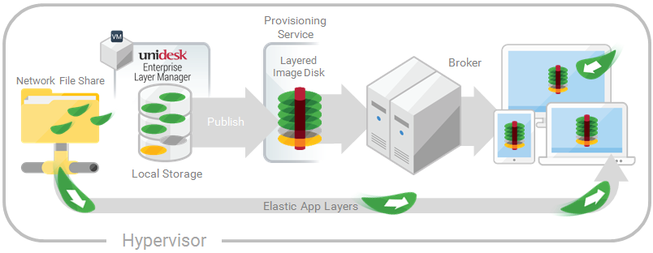

[Assign Layers](layer_assign_apps_co4)
 > Assign App Layers to users via Elastic Assignments
#Assign App Layers to users elastically (Elastic Layers)
In this article:
<table>            <col></col>            <tbody>                <tr>                    <td>                        
<a href="#You"> Assign apps elastically</a>                        
                        
<a href="#Prerequisites"> Prerequisites and limitations</a>                        
                        
<a href="#Enable_Elastic_Layers_in_Image"> Enable  Elastic Layering in the base image</a>                        
                        
<a href="#Elastic_Fit"> Run the Elastic Fit Analyzer on  App Layers  (Unidesk Labs)</a>                        
                        
<a href="#Assign"> Elastically assign an App Layer to ADUsers and Groups</a>                        
                        
<a href="#AssignMachine"> Elastically assign an App Layer to users via machine assignments and associations</a>                        
                        
<a href="#Manage"> Manage Elastic Assignments</a>                        
                    </td>                </tr>            </tbody>        </table>
##Assign apps elastically
Wouldn't it be nice to drastically reduce the number of images you have to manage? What if you could leave apps that only a few users need out of your base image? And, assign the layers to specific users elastically on top of the base image. With the Elastic App Layers feature, you can do just that.
An Elastic App Layer is a Unidesk App Layer that you configure to be delivered to specific users and groups, based on user entitlements, when the users log onto their session hosts or standalone desktops. With Elastic App Layers, you can give each user his/her own unique set of applications in addition to the base Layered Image that is used across sessions in the case of session hosts), and across floating pools/shared groups in the case of desktops.
As this diagram shows, once you add Elastic Assignments to an App Layer,  a copy of the Layer is stored in the ELM's Network File Share, and delivered to individual AD users and groups on-demand, in addition to the Layers that they receive via the base image.

To use this feature, you'll add Elastic Assignments specifying which users and groups should receive each of the App Layers that you would like to leave out of your base images. You'll then publish your base image(s) with the Elastic Layering For Session Hosts selected.
####How users access Elastic Layers assigned to them
When users log into their Session or Desktop, icons for their Elastic Layers will appear as shortcuts on the desktop. 
A user receives an Elastic Layer in the following cases:
<ul>            <li>The user (an ADuser in the Unidesk Management Console) is assigned the Layer.</li>            <li>An AD group that the user belongs to is assigned the Layer. </li>            <li>A machine that the user logs into is a member of an ADGroup that receives the Elastic Layer.</li>            <li>A machine that the user logs into is associated (via the UMC) with an ADGroup that is assigned the Layer via the UMC.</li>        </ul>
####If more than one version of the same Layer is assigned to a user 
If a Layer is assigned directly to the user and indirectly to one or more of the user's groups, the user receives the most recent version of the Layer assigned directly to her/him. For example, if a user is assigned Version 2, and a group that the user belongs to is assigned Version 3, the user will get Version 2. 
If the user is assigned a Layer via one or more group assignments, the user receives the most recent version of the Layer.
####If a user has an App Layer in their Layered Image, and the Layer is also assigned to them elastically
If a user has an App Layer in the Layered Image and the user is also assigned the Layer elastically, they will receive the Elastic Layer, even if the version in the base image is more recent.
##Prerequisites and limitations
###Prerequisites
<ul>            <li>The ELM's Network File Share must be configured correctly:<ul><li>The Share must be configured using SMB technology. When using Elastic Layer assignments, <i>NFS technology is not supported</i>.</li><li>The Share must be set up by the admin to be <b>readonly</b> for all users <i>except</i> for the one configured in the ELM. This secures the Layers and other files stored on the Share. </li><li>The User named in this configuration must have <b>Read/Write</b> permissions on the root of the network file share. Select <b>System > Settings and Configuration</b> and scroll to <b>Network File Share</b>. </li><li>Make sure that any users who will be assigned Elastic Layers have <b>Read only</b> access for the root directory of the Network File Share.</li></ul></li>            <li>.NET Framework 4.5 is required on any Layered Image where Elastic Layers are enabled.</li>            <li>                
The <a href="layer_apps_create_co4.htm">App Layers</a> you want to elastically assign. 
                
<b>Note:</b> App Layers must be created using the <i>same OSLayer</i> used to create the Layered Image that you enable to deliver the Elastic App Layer to users. 
            </li>        </ul>
###Elastic Layering Limitations
You cannot elastically layer the following:
<ul>            <li>Microsoft Office Add-ons and extensions in individual Unidesk Layers. A user must have <i>all</i> of their add-ons in <i>one</i> Layer. Note: Please use the recipe for elastically layering MSOffice.</li>            <li>Applications with drivers that use the driver store. For example, a printer driver.</li>            <li>Applications that modify the network stack or hardware. For example, a VPN client.</li>            <li>Applications that have boot level drivers. For example, a virus scanner.</li>        </ul>
##Enable  Elastic Layering in the base image
When you publish the Layered Image that the users will log into to get the Elastic App Layer(s):
<ol>            <li>                
In the Image Template Wizard, on the Layered Image Disk tab, select <b>Elastic Layering For Session Hosts</b>. 
            </li>            <li>                
Finish publishing the Layered Image.
            </li>            <li>                
Provision your Session Hosts with the new base image. 
                
When the users log in, they should see an icon for each Elastic App Layer they've been assigned.
            </li>        </ol>
##Run the Elastic Fit Analyzer on  App Layers  (Unidesk Labs)
Before assigning an App Layer elastically, use the Elastic Fit Analyzer to determine the likelihood that the Layer assignment will be successful.  
###Elastic Fit Analysis
In the Layer Details, the Elastic Fit rating indicates how likely it is that the Layer will work when elastically assigned. 
<table>            <col></col>            <col></col>            <tbody>                <tr>                    <td>                        
                            </img>                        
                    </td>                    <td>                        
<b>Good Elastic Fit.</b> This layer should work when deployed elastically.
                    </td>                </tr>                <tr>                    <td>                        
                            </img>                        
                    </td>                    <td>                        
<b>Poor Elastic Fit.</b> This layer will probably not work when deployed elastically, or may behave differently than when it is deployed in a Layered Image.
                    </td>                </tr>            </tbody>        </table>
###Elastic Fit Details
You can learn more about the Elastic Fit of a Layer by expanding the Elastic Fit Analysis. If the Elastic Fit is less than ideal, the list of violated rules will be displayed. 
<table>            <col></col>            <col></col>            <tbody>                <tr>                    <td>                        
                            </img>                        
                    </td>                    <td><b>Low Severity Warning.</b>  This is unlikely to cause any change in behavior or functionality for most applications.</td>                </tr>                <tr>                    <td>                        
                            </img>                        
                    </td>                    <td><b>Medium Severity Warning.</b> This may cause minor changes in behavior or functionality for some applications.</td>                </tr>                <tr>                    <td>                        
                            </img>                        
                    </td>                    <td><b>High Severity Warning.</b> This is likely to cause significant changes in behavior or functionality for many applications.</td>                </tr>            </tbody>        </table>
###Enable Elastic Fit in Unidesk Labs
To use this Unidesk Labs feature, you must enable it. To enable Elastic Fit: 
<ol>            <li>In the Unidesk Management Appliance (UMC), select <b>System > Settings and Configuration</b>.</li>            <li>Click <b>Edit</b> Unidesk Labs.</li>            <li>Select the <b>Elastic Fit</b> check box.</li>            <li>Click <b>Save</b>.</li>        </ol>
###Analyze an App Layer for Elastic Fit
All new Layer Versions will be analyzed for elastic layering compatibility when they are finalized. To analyze existing App Layers for Elastic Fit:
<ol>            <li>Log into the Unidesk Management Console (UMC) .</li>            <li>Select <b>Layers > App Layers</b>.</li>            <li>Select the Layer to analyze, and click <b>Analyze Layer</b>.</li>            <li>On the Select Versions tab, choose the Layer Versions to analyze. </li>            <li>On the Confirm and Complete tab, click <b>Analyze Layer Versions</b>. The analysis takes seconds.</li>            <li>To see the Elastic Fit Analysis, select the App Layers module, move the mouse pointer over the Layer icon and click the <b>Info</b> </img> icon. </li>            <li>Expand the <b>Version Information</b> for each Layer Version, and look for the Elastic Fit rating.  </li>            <li>For a detailed report, expand the <b>Elastic Fit Details</b>. If the Elastic Fit is less than ideal, the list of violated rules will be displayed. </li>            <li>You can display the AD tree and hide the violated rules by clicking a button acknowledging that the layer is unlikely to work as expected.</li>        </ol>
###Upgrading from Earlier Releases
After upgrading from an earlier Unidesk release, the Elastic Fit Detail shows that any existing Layer Version(s) have not been analyzed. Until you run the analysis on existing Layer Versions, the Versions will have a single High severity Elastic Fit Detail, and a Poor Elastic Fit.
##Elastically assign an App Layer to AD##Users and Groups
The first time you assign an App Layer elastically, we recommend starting with an app like Notepad++ or GIMP, because they are simple to . 
<ol>            <li>Log into the Unidesk Management Console (UMC) as an Admin user, and select <b>Layers > App Layers</b>.</li>            <li>Select an App Layer that is <i>not going to be included in the base image</i>, and select <b>Add Assignments</b>. </li>            <li>In the wizard that opens, select the Version of the App Layer that you want to assign users.</li>            <li>Skip the <b>Image Template Assignment</b> tab. This tab is for assigning the Layer to an Image Template.</li>            <li>In the ElasticAssignment tab, select the users and groups who should get this App Layer.</li>            <li>In the Confirm and Complete tab, review your selections, and click <b>Assign Apps</b>.</li>        </ol>
When the users log in, they should see an icon for each Elastic App Layer they've been assigned.
##Elastically assign an App Layer to users via machine assignments and associations
Any machine running the Unidesk Layering Service (ULayer.exe) can have Elastic Layers assigned to it. You can accomplish this by either adding the machine to or associating it with the ADGroup, and then elastically assigning the App Layers to the ADGroup. 
The Layers assigned to the machine will be available to every User who successfully logs into that machine. The Unidesk Layering Service will scan for changes to the machine's AD group memberships and associations every 10 minutes. When the users log in, they should see an icon for each Elastic App Layer they've been assigned.
###Use Active Directory to add the machine to the ADGroup
Assuming you have a published Layered Image booted in your environment, you can add the machine to an ADGroup, and assign Elastic Layers to the ADGroup.
<ol>            <li>Use Active Directory (AD) to add the machine to an ADGroup.</li>            <li>Select an App Layer that is <i>not going to be included in the base image</i>, and <a href="#Assign">elastically assign</a> the Layer(s) to an ADGroup. </li>            <li>                
You can wait for ADto propagate the changes and be recognized by the Unidesk Layering Service, or you can force the Unidesk Layering Service to update its list of machine groups by doing <i>one</i> of the following:
                <ul>                    <li>                        
Wait for the Unidesk Layering Service to detect the changes (within 10 minutes by default).
                    </li>                    <li>                        
Restart the Unidesk Layering Service. 
                    </li>                    <li>                        
Reboot the Unidesk Layering Service Machine.
                    </li>                    <li>                        
Execute the <b>refresh.groups</b> command: 
<pre>C:\Program Files\Unidesk\Layering Services\ulayer.exe refresh.groups</pre>                    </li>                </ul>            </li>        </ol>
####Example 
You start with an AD User, and ADGroup, and a machine that you provisioned using a Layered Image.
<ul>            <li>AD User: <i>Kenya</i><ul><li>Kenya has no elastic assignments.</li></ul></li>            <li>ADGroup:<i>Marketing</i><ul><li>The <i>Marketing</i> group includes the member Kenya.</li></ul></li>            <li>Machine: <i>ElasticTestMachine</i><ul><li>The <i>ElasticTestMachine</i> base image includes the <i>MSOffice App Layer</i>.</li></ul></li>        </ul>
In this example, you elastically assign the Chrome App Layer to  ElasticTestMachine:
<ol>            <li>In AD, you add the machine <i>ElasticTestMachine</i> to the <i>Marketing</i> ADGroup.</li>            <li>In the Unidesk Management Console (UMC) you <a href="#Assign">elastically assign</a> the <i>Chrome App Layer</i> to the <i>Marketing</i> Group.</li>            <li>When Kenya, who is part of the Marketing group, logs into <i>ElasticTestMachine</i>, she receives both the <i>MSOffice App Layer</i>, which is in the base image, and the <i>Chrome App Layer</i>.</li>            <li>When any user who is <i>not</i> in the <i>Marketing</i> group logs into <i>ElasticTestMachine</i>, they also receive both Layers: <i>MSOffice</i> because it is in the base image, and <i>Chrome</i> because the <i>ElasticTestMachine</i> is a member of the <i>Marketing</i> ADGroup.</li>        </ol>
###Use the UMCto associate the machine with an ADGroup
Associating a set of machines with an AD Group allows any machine running the Unidesk Layering Service to have Layers elastically assigned to it via AD group membership. 
Elastic Layers granted via Machine association can be thought of as extending the layers assigned to a user. For example, if a machine matches multiple Machine Associations, only the unique layers will be added to the ones the user already has. 
In the UMC, you use asterisk (*) wildcards in a machine name pattern to specify a set of machine names. For example:
<table>            <col></col>            <col></col>            <col></col>            <thead>                <tr>                    <th>                        
Machine name pattern
                    </th>                    <th>                        
Matches these names
                    </th>                    <th>                        
Does <i>not</i> match these names
                    </th>                </tr>            </thead>            <tbody>                <tr>                    <td>                        
machine*
                    </td>                    <td>                        
machine01
                        
machineindetroit
                    </td>                    <td>                        
amachine
                        
localtestmachine
                    </td>                </tr>                <tr>                    <td>*machine</td>                    <td>                        
amachine
                        
localtestmachine
                    </td>                    <td>                        
machine01
                        
machineindetroit
                    </td>                </tr>                <tr>                    <td>ky*eng</td>                    <td>                        
ky02359eng
                        
kytesteng
                    </td>                    <td>                        
01ky_eng
                        
testky01eng
                    </td>                </tr>                <tr>                    <td>*eng*</td>                    <td>                        
eng01
                        
1eng
                        
1eng01
                    </td>                    <td>                        
en01
                        
1en
                        
1en01
                    </td>                </tr>            </tbody>        </table>
You can create Machine Associations before or after elastically assigning App Layers to the ADGroup. Also, the machines do not need to exist when you add the associations, as the associations exist within Unidesk only, and AD is not aware of them. 
####Associate a set of machines with an AD####Group
<ol>            <li>                
Log into the Unidesk Management Console (UMC) as an Admin user, and select <b>Users > Tree</b>.
            </li>            <li>                
Expand the Tree, select the appropriate Group and click <b>Edit Properties</b> in the Action bar. This opens the Edit Group Wizard. 
                
<a href="Resources/Images/machine_association_notchecked.png"></img></a>                
            </li>            <li>                
Select the checkbox, <i>Associate machines with this AD Group</i>. This reveals the <i>Machine Name Pattern</i> field:
                
<a href="Resources/Images/machine_association_checked.png"></img></a>                
            </li>            <li>                
Specify a set of machines to associate with the AD group by entering a machine name pattern. For examples, see the above table of Machine name patterns.
            </li>            <li>                
On the Confirm and Complete tab, select <b>Update Group</b>. Notice the shape of a computer monitor superimposed over the group icon. This indicates that machines are associated with the group.
                
                    </img>                
                
When you click the group's </img> icon, the Detail view now includes a field called, <i>Associate With Machines</i> where the pattern. 
                
<a href="Resources/Images/machine_association_details.png"></img></a>                
            </li>        </ol>
####Example
You start with the machine, Mach1, the ADGroup, MachineGroup, and the App Layers for Firefox and MSOffice. 
<ul>            <li>Machine: <i>Mach1</i></li>            <li>ADGroup:<i>MachineGroup</i></li>            <li>App Layers: <i>Firefox</i>, <i>MS Office</i></li>        </ul>
Further, you have elastically assigned the Firefox and MSOffice Layers to the AD Group. 
If you add a Machine Association to MachineGroup with a name pattern of "Mach*", when any domain user logs into Mach1, they will receive the Firefox and MS Office Elastic App Layers.
##Manage Elastic Assignments
You can: 
<ul>            <li>View a user's Elastic Layer assignments.</li>            <li>Update  an App Layer and elastically assign the new Version of the Layer. </li>            <li>Remove Elastic Assignments.</li>            <li>Debug an Elastic Assignments.</li>        </ul>
View a user's Elastic Layer assignments
<ol>            <li>Log into the UMC and select <b>Users > Tree</b>.</li>            <li>Select an ADUser or Group, and click the "i" icon to the <i>right</i> of the name. If the user or group is assigned any Elastic Layers, the Layers are listed just below the user's or group's profile information in the Details window that appears.</li>        </ol>
###Update an App Layer and its Elastic Assignments
You've added Elastic Assignments to an App Layer, and users are accessing the app as expected. A new version of the application is released, so you update it by adding a new Version to the Layer. Now you need to assign the new version to the users who have the Layer.
<ol>            <li>Log into the UMC and select <b>Layers > App Layers</b>.</li>            <li>Select the elastically assigned App Layer that you just updated.</li>            <li>Right-click the Layer icon and select <b>Update Assignments</b>.</li>            <li>In the wizard that opens, select the new Version.</li>            <li><i>Skip</i> the Image Template Assignment tab.</li>            <li>                
In the Elastic Assignment tab, there's a list of Users and Groups who have been assigned a different version of the selected Layer. Select the users and groups to whom you want to assign the new Version of the Layer. 
                
<b>Notes:</b> 
                <ul>                    <li>If the list is long, use the <b>Search</b> field to filter the results. </li>                    <li>If the list is empty, click the check box called, <b>Show AD users and groups already at this version</b>. A list of grayed out names may appear. These users have already been assigned the Version.</li>                </ul>            </li>            <li>On the Confirm and Complete tab, verify the Users and Groups selected to receive the new Version, and click <b>Update Assignments</b>.</li>        </ol>
###Remove a Layer's Elastic Assignments
<ol>            <li>                
Log into the UMC and select <b>Layers > App Layers</b>.
            </li>            <li>                
Select the App Layer for which you want to remove assignments, and select <b>Remove Assignments</b>..
            </li>            <li>                
In the wizard that opens, select the assigned templates from which you want to remove the Layer. All of the assignments for that layer are listed.
                
If the list is long, use the Search field to filter the results. 
            </li>            <li>On the Confirm and Complete tab, verify the Image Templates selected to receive the new Version, and click <b>Update Assignments</b>.</li>        </ol>
###Debug an Elastic Layer
If you have an Elastic Layering issue, you can diagnose the problem by finding out whether the layer is being delivered, and if so, whether it is working correctly. If needed, collect data for Unidesk Support, as described here.
####Is this a Delivery issue?
Are the things you'd expect to see if this app were installed actually there as expected?
<ul>            <li>Do you see the files and registry entries for the layer?</li>            <li>If the app is supposed to be in the Start menu, is it there?</li>            <li>If there should be a shortcut for the app on the user's desktop, is there one?</li>        </ul>
If you discover that app delivery is an issue, you can collect the following data, open a case, and send the data to Unidesk Support.
<ol>            <li>                
Collect the data from these logs:
                <ul>                    <li>Windows App Event log – In the Windows Event Viewer under Windows Logs, export the Application event log as an EVTX file.</li>                    <li>Unidesk Layering Service log (ulayersvc.log) – C:\ProgramData\Unidesk\Logs\ulayersvc.log</li>                </ul>            </li>            <li>                
Collect the values of these Registry keys:
                <ul>                    <li>HKEY_LOCAL_MACHINE\SOFTWARE\Unidesk\ULayer:AssignmentFile</li>                    <li>HKEY_LOCAL_MACHINE\SOFTWARE\Unidesk\ULayer:RepositoryPath</li>                </ul>            </li>            <li>                
Collect the contents of the Assignment (ElasticLayerAssignments.json) and Layers (Layers.json) files from the Repository Path.
            </li>            <li>                
Contact Support.
            </li>        </ol>
####Is this an operational issue?
One of these issues could indicate that this is an Elastic Layering issue:
<ul>            <li>The app is being delivered but doesn't launch correctly.</li>            <li>An operation within the app doesn't work correctly.</li>            <li>A licensing problem or a security issue.</li>            <li>The app launches, but then misbehaves, for example, it crashes on startup, or starts up but doesn't work right.</li>        </ul>
If the problem with the Layer is operational, test the App Layer in the base image to rule out general layering issues:
<ol>            <li>Add the App Layer to an Image Template, and publish a Layered Image that includes the App Layer.</li>            <li>Log in as a user who is <i>not</i> assigned the Layer elastically, and make sure that the application is operational in the base image.</li>            <li>Contact Support with your findings.</li>        </ol>


