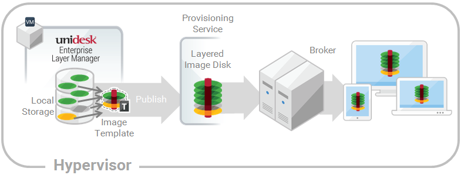

[Assign Layers](layer_assign_apps_co4)
 > Assign App Layers to Image Templates
#Assign an App Layer to Image Templates
In this article:
<table>            <col></col>            <tbody>                <tr>                    <td>                        
<a href="#Prerequi"> Prerequisites</a>                        
                        
<a href="#Assign"> Add an App Layer Assignment to one or more Image Templates</a>                        
                        
<a href="#Update"> Update App Layers and Image Template Assignments</a>                        
                        
<a href="#Remove"> Remove Template Assignments</a>                        
                    </td>                </tr>            </tbody>        </table>
An Image Template is a stored selection of Layers and settings that you use to publish Layered Images. At minimum, an Image Template contains an OS Layer, Platform Layer, and settings. Ideally, each template also contains your choice of App Layers for a particular image, for example, an image suited for the users served by a particular silo. Once you publish a Layered Image, you can provision systems using the  image. 

When you create a new App Layer, you can assign the App Layer to one or more Unidesk Image Templates, and then use the templates to publish Layered Images that include the layer. This article explains how to  assign an App Layer to one or more Image Templates, and update the assignments when you update the Layer. 
When you first update an App Layer, the new Layer Version is not assigned to any Image Templates, so you'll need to update the Layer Assignments. Updating the assignments allows you to assign different Versions of the Layer to different Image Templates. You cannot assign an App Layer to 
Important: When assigning App Layers, be sure to avoid assigning the app elastically to a user, if the app is already in the Layered Image that the user gets.
##Prerequisites
<ul>            <li>One or more App Layers.</li>            <li>One or more Image Templates.</li>        </ul>
##Add an App Layer Assignment to one or more Image Templates
<ol>            <li>Log into the Unidesk Management Console (UMC) as an Admin user, and select <b>Layers > App Layers</b>.</li>            <li>Select an App Layer  to include in one or more of your Image Templates, and click <b>Add Assignments</b>. </li>            <li>In the wizard that opens, select the  App Layer that you want to assign to templates.</li>            <li>On the ImageTemplate Assignment tab, select the templates in which you want to include this App Layer Version.</li>            <li>Skip the Elastic Assignment tab.</li>            <li>In the Confirm and Complete tab, review your selections, and click <b>Assign Apps</b>. </li>        </ol>
When you open each of the Image Templates you will see the App Layer Version you just assigned to the template.
##Update App Layers and Image Template Assignments
When you update an application by adding a new Version to the App Layer, the new Layer Version will not inherit the original Layer Assignments. You need to assign the new App Layer Version.
<ol>            <li>                
Log into the UMC and select <b>Layers > App Layers</b>.
            </li>            <li>                
Select the App Layer that has been updated.
            </li>            <li>                
Right-click the Layer icon and select <b>Update Assignments</b>.
            </li>            <li>                
In the wizard that opens, select the new App Layer Version. 
            </li>            <li>                
Click the <b>Image Template Assignment</b> tab, and select the Image Templates to which you want to assign the new Layer Version . 
                
<b>Notes:</b>
                <ul>                    <li>If the list is long, use the <b>Search</b> field to filter the results. </li>                    <li>If the list is empty, click the check box called, <b>Show Image Templates already at this version</b>. A list of grayed out names may appear. These Image Templates have already been assigned the Version.</li>                </ul>            </li>            <li>Skip the Elastic Assignment tab.</li>            <li>On the Confirm and Complete tab, verify the Image Templates selected to receive the new Version, and click <b>Update Assignments</b>.</li>        </ol>
##Remove Template Assignments
When you remove an App Layer's Template Assignments, the assignments for all versions of the Layer are removed. If you want to remove the assignments for a specific Version of the Layer, select Update Assignments instead.
<ol>            <li>                
Log into the UMC and select <b>Layers > App Layers</b>.
            </li>            <li>                
Select the App Layer for which you want to remove assignments, and select <b>Remove Assignments</b>..
            </li>            <li>                
In the wizard that opens, select the assigned templates from which you want to remove the Layer. All of the assignments for that layer are listed.
                
If the list is long, use the Search field to filter the results. 
            </li>            <li>On the Confirm and Complete tab, verify the Image Templates selected to receive the new Version, and click <b>Update Assignments</b>.</li>        </ol>

