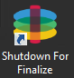

[Platform Layers](layer_platform_create_co4)

 > Citrix PVS (Citrix PVS connector)

#Create a Platform Layer (PVS)

In this article:

<table>            <col></col>            <tbody>                <tr>                    <td>                        
<a href="#Before"> Before you start</a>                        
                        
<a href="#Create2"> Prepare a new Platform Layer</a>                        
                        
<a href="#Deploy"> Deploy a Packaging Machine </a>                        
                        
<a href="#Install"> Create a Platform Layer (PVS)</a>                        
                        
<a href="#Verify"> Verify the Layer and shut down the Packaging Machine</a>                        
                        
<a href="#Finalize">Finalize the Layer</a>                        
                    </td>                </tr>            </tbody>        </table>
A Platform Layer is intended to include the platform software and settings required to deploy images in your environment. For example, a Platform Layer for publishing to PVS in vSphere with XenApp as the broker would include the PVS Target Device Imaging software, vmTools, and the XenApp Virtual Delivery Agent Installer (and other platform-related software as well). 
 
You can create two kinds of Platform Layers:

<ul>            <li>                
Platform Layers for <i>publishing Layered Images</i> (Required) - These Layers include the software and settings required for a Layered Image to run flawlessly in your environment. 
            </li>            <li>                
Platform Layers for <i>packaging Layers</i> (Required in some cases) - These Layers include the hypervisor software and settings you need to easily install the software for your other layers on a VM in your hypervisor environment.
            </li>        </ul>
To create a Platform Layer you prepare the layer using the Create Platform Layer wizard, deploy a Packaging Machine in your environment, install the tools and configure the settings for PVS, and finalize the Layer. 
 
##Before you start
###Platform Layer Prerequisites

<ul>            <li>                
<a href="layer_os_create_co4.htm">An OSLayer</a>                
            </li>        </ul>
###PVS###Prerequisites 
 
<ul>            <li>                
<b>IPv6 must be </b><i>disabled</i><b> on the OSLayer.</b> 
                
If IPv6 is not disabled on your OSLayer, add a new Version to the OSLayer and disable IPv6 in the new Version. 
                
<b>IMPORTANT:</b> If you disable IPv6 on the <i>Platform Layer</i> instead of on the <i>OSLayer</i>, the resulting PVSmachines  will lose their network connection and hang when they are booted. 
            </li>            <li>                
<b>Unidesk Agent</b>                
                
The Unidesk Agent must be installed on all PVS servers used to access the PVS servers to which you will publish images. (Each Agent must be registered wit the Unidesk ELM.)
            </li>            <li>                
<b>PVSservers where the Unidesk Agent is installed</b>                
                
The PVSConsole must be installed on all PVS servers where the Unidesk Agent is installed.
            </li>            <li>                
<b>PVS Target Device Imaging software</b>                
                
The PVS Target Device Imaging software must be available to install on the Platform Layer. The version must match the PVS server where the Layered Image will be published.
            </li>            <li>                
<b>PVSresource information</b>                
                
The PVSinfo listed in this <a href="connector_config_fields_pv4.htm">PVS Connector Configuration</a> topic.
            </li>            <li>                
<b>PowerShell Snap-in</b>                
                
Appropriate PowerShell Snap-in must be installed.
            </li>            <li>                
<b>Unique CMID for each target device (if using KMS)</b>                
                
When using KMS licensing, PVS requires that each target device has a unique CMID. For the full story, check out this Citrix article, <a href="https://www.citrix.com/blogs/2014/05/01/demystifying-kms-and-provisioning-services/">Demystifying KMS and Provisioning Services</a>. Rearming KMS is covered in the steps to Create a Platform Layer. 
            </li>            <li>                
<b>Any additional PVS settings you use in your environment</b>                
                
Any settings you need to configure PVSon your Platform Layer so that it matches the environment where the Layered Image will be used.
            </li>        </ul>
###Required Tools and Settings

<ul>            <li>Unidesk Tools download</li>            <li>PVS settings</li>            <li>KMS settings</li>        </ul>

##Prepare a new Platform Layer
<ol>            <li>                
Select <b>Layers >Platform Layers</b> and select <b>Create Platform Layer</b> in the Action bar. This opens the Create Platform Layer wizard.
            </li>            <li>                
In the Layer Details tab, enter a <b>Layer Name</b> and <b>Version</b>, both required values. Optionally, you can also enter other values. For details, see more about these values <a href="#Create">below</a>.
            </li>            <li>                
In the OSLayer tab, select the OSLayer you want to associate with this Platform Layer. 
            </li>            <li>                
In the Connector tab, choose a Connector Configuration for the platform where you are creating this layer. If the configuration you need isn't listed, add a <b>New</b> <a href="#">Connector Configuration</a> and select it from this list.
                
Example: If you are creating the layer in your vSphere environment, select the vSphere connector with the information needed to access the temporary storage location where you will package this layer.
            </li>            <li>                
In the Recipe Associations tab, select all of the platforms to which you will be publishing the Layered Image. 
                
Example: If you want to use this Platform Layer to publish Layered Images to both vSphere and Azure, select both environments.
            </li>            <li>                
In the Packaging Disk tab, enter a <b>file name</b> for the Packaging Disk, and select the disk format. This disk will be used for the Packaging Machine (the VM)where you will install the tools, as described in the next two sections.
            </li>            <li>                
In the Icon Assignment tab, select an icon to assign to the layer. This icon represents the layer in the Layers Module.
                <ul>                    <li>To use an existing image, select an image in the image box.</li>                    <li>To import a new image, click <b>Browse</b>  and select an image in PNG or JPG format.</li>                </ul>            </li>            <li>                
In theConfirm and Complete tab, review the details of the App Layer, enter a comment if required, and click <b>Create Layer</b>. Any comments you enter will appear in the  Information view Audit History. 
            </li>            <li>                
Expand the Tasks bar at the bottom of the UI, and double-click the Packaging Disk task to show the full task description. 
                
Once the Packaging Disk has been created, the Task bar displays the location of the Packaging Disk in your environment. 
                
<a href="Resources/Images/layers_app_action_required_vs.png"></img></a>                
            </li>        </ol>
Next, you can deploy the Packaging Machine for your Layer.

##Deploy a Packaging Machine 
The Packaging Machine is a virtual machine where you install the tools for your selected environment. 
 
Note: The Packaging Machine is a temporary VM that will be deleted once the new Platform Layer has been finalized.

###Log into the Packaging Machine 
 
The Task Description (example shown in the last step above) contains the location of the Packaging Machine in your environment.

<ol>            <li>Log into your vSphere web client.</li>            <li>                
Back in the Unidesk Management Console, use the instructions in the expanded Packaging Disk Task shown below to navigate to the Packaging Machine. 
                
<a href="Resources/Images/layers_app_action_required_vs.png"></img></a>                
            </li>            <li>Power on the Packaging Machine.</li>        </ol>

##Install the required platform tools

This section explains how to install the platform software to be used by the Platform Layer. The platform software to install includes the provisioning server software and/or connection broker software that your Layered Images will need to run in the target environment. 
 
###Platform software to install

You need the installers for your hypervisor, provisioning service, and connection broker. 
 
If you are using a supported Unidesk Connector to connect to your environment, you will install the provisioning service and/or connection broker software on the Packaging Machine that Unidesk created in that environment. Otherwise, you will be installing the software on a VM in your hypervisor of choice, moving the VMto the Unidesk network file share, from which you can import the VMinto Unidesk.

Keep in mind that the state of the software before you finalize the layer is what the image will use. 
 
<ol>            <li>                
Remote log in to the Packaging Machine you created. Be sure to log in using the User account you used to create the OS. 
            </li>            <li>                
Install the tools that your Layered Image will need to run on vSphere and in PVS, along with any drivers, boot-level applications, or files needed.
                
If a software installation requires a system restart, restart it manually. The Packaging Machine does not restart automatically.
            </li>            <li>                
Make sure the Packaging Machine is in the state you want it to be in when the image is booted:
                <ul>                    <li>If the tools you install require any post-installation setup or registration, complete those steps now.  </li>                    <li>Remove any settings, configurations, files, mapped drives, or applications that you do not want to include on the Packaging Machine.</li>                </ul>            </li>        </ol>
Next, you'll need to shut down the Packaging Machine and verify that the Platform Layer is ready to finalize.

Verify the Layer and shut down the Packaging Machine
Once the tools are installed on the Packaging Machine, the next step is to verify that the Layer is ready to finalize. At this point, any required post-installation processing needs to be completed. For example, a reboot may be required, or a Microsoft NGen process may need to complete.

To verify that any outstanding processes are complete, you can run the Shutdown For Finalize tool (icon below), which appears on the Packaging Machine's desktop.  
  

To use the Shutdown For Finalize tool:

<ol>            <li>If you are not logged into the Packaging Machine, remote log in as the user who created the machine.</li>            <li>Double-click the <i>Shutdown For Finalize</i> icon. A command line window displays messages detailing the layer verification process. </li>            <li>If there is an outstanding operation that must be completed before the Layer can be finalized, you are prompted to complete the process. For example, if a Microsoft NGen operation needs to complete, you may be able to expedite the NGen operation, as detailed <a href="#Layer_Integrity_Check">below</a>.</li>            <li>Once any pending operations are complete, double-click the <i>Shutdown For Finalize</i> icon again. This shuts down the Packaging Machine. </li>        </ol>

The Layer is now ready to finalize.

###Layer integrity messages you may see during the finalization process
Layer integrity messages let you know what queued tasks must be completed before a Layer is finalized.

The new Layer or Version can only be finalized when the following conditions have been addressed:
<ul>            <ul>                <li>A reboot is pending to update drivers on the boot disk - please check and reboot the Packaging Machine.</li>                <li>A post-installation reboot is pending - please check and reboot the Packaging Machine.</li>                <li>An MSI install operation is in progress - please check the Packaging Machine.</li>                <li>                    
A Microsoft NGen operation is in progress in the background. 
                    
<b>Note:</b> If a Microsoft NGen operation is in progress, you may be able to expedite it, as described in the next section.
                </li>            </ul>        </ul>
###Expediting a Microsoft NGen operation 
NGen is the Microsoft Native Image Generator.  It is part of the .NET system, and basically re-compiles .NET byte code into native images and constructs the registry entries to manage them.  Windows will decide when to run NGen, based on what is being installed and what Windows detects in the configuration.  When NGen is running, you must let it complete.  An interrupted NGen operation can leave you with non-functioning .NET assemblies or other problems in the .NET system.

You have the choice of waiting for the NGen to complete in the background, or you can force the NGen to the foreground. You can also check the status of the NGen operation, as described below. However, every time you check the queue status, you are creating foreground activity, which might cause the background processing to temporarily pause. 
 
Forcing the NGen to the foreground will allow you to view the progress and once the output has completed, you should be able to finalize the layer.

<ol>            <li>                
Force an NGen operation to the foreground. 
                
Normally, NGen is a background operation and will pause if there is foreground activity.  Bringing the task into the foreground can help the task to complete as quickly as possible. To do this:
                <ol>                    <li>                        
Open a command prompt as Administrator.
                    </li>                    <li>                        
Go to the Microsoft .NET Framework directory for the version currently in use:
<pre>cd C:\Windows\Microsoft.NET\FrameworkNN\vX.X.XXXXX</pre>                    </li>                    <li>                        
Enter the NGen command to execute the queued items:
<pre>ngen update /force</pre>                        
This brings the NGen task to the foreground in the command prompt, and lists the assemblies being compiled. 
                        
<b>Note:</b> It’s okay if you see several compilation failed messages!
                    </li>                    <li>Look in the Task Manager to see if an instance of MSCORSVW.EXE is running. If it is, you must allow it to complete, or re-run ngen update /force.  Do <i>not</i> reboot to stop the task. You <i>must</i> allow it to complete.</li>                </ol>            </li>            <li>                
Check the status of an NGen operation
                <ol>                    <li>                        
Open a command prompt as Administrator.
                    </li>                    <li>                        
Check status by running this command:
<pre>ngen queue status</pre>                    </li>                    <li>                        
When you receive the following status, the NGen is complete, and you can finalize the Layer.
<pre>The .NET Runtime Optimization Service is stopped</pre>                    </li>                </ol>            </li>        </ol>

##Finalize the Layer

Once the Packaging Machine is created, the softwareis installed and ready to finalize, and you have shut down the machine, you'll need to finalize the Layer. 
 
Note: When you finalize a Layer, Unidesk may delete the Packaging Machine so as not to incur extra cost for storage. 
 
When the Layer has been verified and is ready to finalize:

<ol>            <li>Return to the Unidesk Management Console.</li>            <li>Select <b>Layers >App Layers</b>, and then the layer you just prepared.</li>            <li>Select Finalize in the Action bar.</li>            <li>Monitor the Task bar to verify that the action completes successfully and that the Layer is deployable.</li>        </ol>

