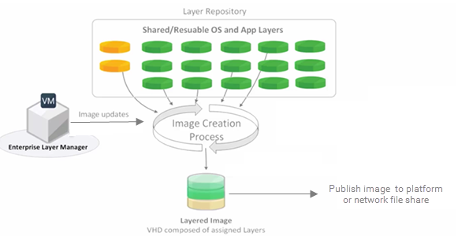
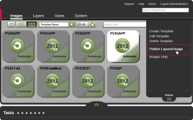

You are here: Learn about Citrix App Layering [UnideskVersion Layering 4.0.8] > Publish > Publishing essentials
#Publishing essentials 
Unidesk lets you publish Layered Images as disks compatible with your platform. You can use a Layered Image to provision servers, as you would with any other image. 
##About Layered Images
Layered Images are bootable images composited from Unidesk Layers. Each Layered Image contains an OS Layer, a Platform Layer, and any number of App Layers. 

##Creating and updating Layered Images
The way you specify which layers to include in a Layered Image is by saving the combination of layers you want for a particular group of users in an Image Template. You then use this template to publish a Layered Image to your chosen platform. 

When you need to update the Layered Image, you simply edit the Image Template to add or remove layer assignments, and publish a new version of the image.



