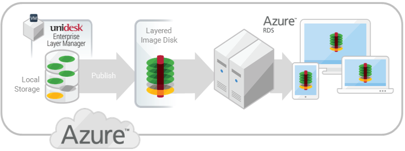
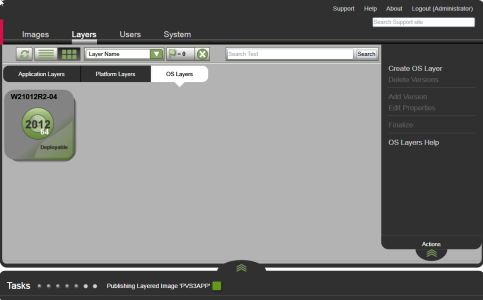
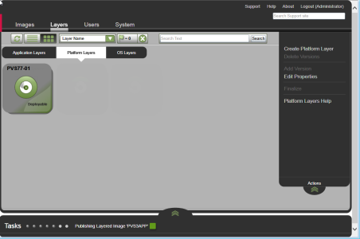
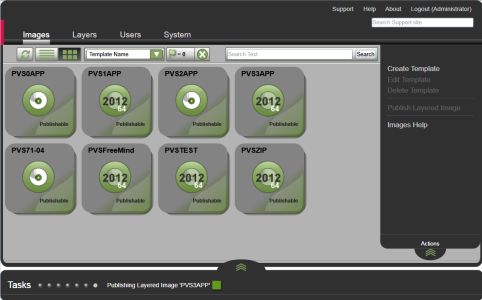
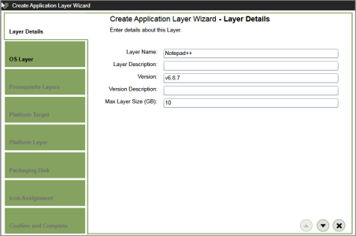

You are here: Learn about Citrix App Layering [UnideskVersion Layering 4.0.8] > Test drive > Publish to Azure RDSH in Azure
#Test drive: Publishing to  Azure RDSH
In this article:
<table>            <col></col>            <tbody>                <tr>                    <td>                        
<a href="#Platform"> Platforms used in this test drive</a>                        
                        
<a href="#Componen"> Components you will create</a>                        
                        
<a href="#Prerequi"> Prerequisites</a>                        
                        
<a href="#Part"> Publish a test image with an OSLayer and a Platform Layer</a>                        
                        
<a href="#Part2"> Add your first App Layer and republish the Layered Image</a>                        
                    </td>                </tr>            </tbody>        </table>
##Platforms used in this test drive
<table>            <col></col>            <col></col>            <tbody>                <tr>                    <td>Create Layers in:</td>                    <td>Azure</td>                </tr>                <tr>                    <td>Publish Layered Images to:</td>                    <td>Azure RDSH</td>                </tr>                <tr>                    <td>For delivery to: </td>                    <td>Azure users</td>                </tr>            </tbody>        </table>
This test drive leads you through the process of publishing a Layered Image as a virtual disk to an Azure server. the hypervisor in this scenario is Azure, and the connection broker is Azure. 

##Components you will create
<table>            <col></col>            <col></col>            <tbody>                <tr>                    <th>Component</th>                    <th>Description</th>                </tr>                <tr>                    <td>OSLayer</td>                    <td>                        <ul>                            <li>Contains Windows Server 2012 R2 </li>                            <li>Unidesk Tools are installed</li>                        </ul>                    </td>                </tr>                <tr>                    <td>Platform Layer</td>                    <td>                        <ul>                            <li>Layer containing all platform-related software and settings</li>                            <li>Created in Azure using an Azure VM for the Packaging Machine</li>                        </ul>                    </td>                </tr>                <tr>                    <td>App Layer</td>                    <td>                        <ul>                            <li>Notepad++</li>                        </ul>                    </td>                </tr>                <tr>                    <td>Image Template</td>                    <td>                        <ul>                            <li>Created in two stages:<ul><li> Stage 1: Includes OS Layer ; Platform Layer</li><li>Stage 2: Includes the addition of App Layer </li></ul></li>                        </ul>                    </td>                </tr>                <tr>                    <td>Layered Image</td>                    <td>                        <ul>                            <li>Image Template</li>                            <li>OS Layer</li>                            <li>Platform Layer</li>                            <li>App Layer</li>                        </ul>                    </td>                </tr>                <tr>                    <td>Azure virtual disk</td>                    <td>                        <ul>                            <li>Contains the Unidesk Layered Image</li>                        </ul>                    </td>                </tr>            </tbody>        </table>
##Prerequisites
<table>            <col></col>            <col></col>            <tbody>                <tr>                    <td>                        <h3>Unidesk</h3>                        
o Unidesk ELMinstalled on a server in your Azure environment.
                        
o Unidesk Tools downloaded from the Unidesk Download page and copied to a location that the Packaging Machine VM will be able to access.
                        <h3>OS for images</h3>                        
o OS for Layered Images. You need a Unidesk-supported <a href="welcome_platform_support_co4.htm#Session">operating system</a> to import into an OSLayer. This OSwill be used to build your Layered Images.
                    </td>                    <td>                        <h3>Azure</h3>                        
o Azure account and subscription. To deploy and configure the Unidesk ELM, you will need the credentials for an account that has administrative access to your Azure subscription. For more information, refer to the <a href="https://account.windowsazure.com/signup?offer">Microsoft Azure Sign in page</a>.
                    </td>                </tr>            </tbody>        </table>
##Publish a test image with an OS##Layer and a Platform Layer
In this part of the test drive you will:
<table>            <col></col>            <tbody>                <tr>                    <td>                        
<a href="#Step"> Step 1: Create an OSLayer</a>                        
                        
<a href="#Step3_platform_pulishing"> Step 2: Create a Platform Layer for Publishing Layered Images</a>                        
                        
<a href="#Step4_template"> Step 3: Create an Image Template</a>                        
                        
<a href="#Step5_publish"> Step 4: Publish a Layered Image to Azure RDSH</a>                        
                        
<a href="#Step6_provision"> Step 5: Provision a Session Host</a>                        
                    </td>                </tr>            </tbody>        </table>
###Step 1: Create an OS###Layer

In this step you will create an Azure VM to use as your OSMachine, and prepare the OS on it. You will then use an Azure Connector Configuration to import the OS image into a new OSLayer.
<ol>            <li>                
In the <a href="https://portal.azure.com/">Microsoft Azure portal</a>, create a new VM from the "Windows Server Remote Desktop Session Host Windows Server 2012 R2" image (<b>New > Virtual Machine > Windows Server Remote Desktop Session Host Windows Server 2012 R2</b>). 
                
<b>Important:</b> When creating the image, be sure to choose the default cluster allocation size of 4K.
            </li>            <li>                
Choose <b>Resource Manager</b> from the <b>Select a deployment model</b> option list and click <b>Create</b>.
                
<b>Note:</b> Unidesk for Azure does <i>not</i> support the <b>Classic</b> option from the <b>Select a deployment model</b> option list.
            </li>            <li>                
Create the OS machine by completing the Create virtual machine wizard.
                <ul>                    <li>The name of the new server machine you specify must comply with Azure naming conventions. </li>                    <li>The User name and Password of the new server machine you specify becomes the User name  and Password of any Packaging Machines that are subsequently created containing this OS Layer.</li>                    <li>Be sure that the value for the Resource group location matches the Storage account location that you configured in the Platform Connector Configuration.</li>                </ul>            </li>            <li>                
Reboot the new machine, and log into it remotely.
            </li>            <li>                
On the new machine, turn off Windows Automatic Updates (<b>Control Panel > System and Security > Windows Update > Change Settings</b>).
            </li>            <li>                
In a web browser, navigate to the <a href="http://www.unidesk.com/support/downloads">Unidesk Download Center</a>, and in the Tools section, download the Unidesk OS Machine Tools. 
            </li>            <li>                
In Windows Explorer, navigate to the C:\Windows\OEM directory, and rename or delete the "Unattend.wsf" file.
            </li>            <li>                
On the new machine, install the Unidesk drivers by running <b>setup_x64.exe</b>.
            </li>            <li>                
Ensure that this machine is <i>not</i> joined to a domain, as Session Hosts join a domain when you provision them from a Layered Image.
            </li>            <li>                
Perform any pending reboots to the OS machine, and shut down the new OS machine. 
            </li>            <li>                
In the Unidesk ELM, select <b>Layers > OS Layers</b> and click <b>Create OS Layer</b>. This opens the Create Operating System Layer Wizard.
            </li>            <li>                
First, specify a <b>Layer Name</b> and <b>Version</b> in the Layer Details tab.
            </li>            <li>                
In the Connector tab, select the <b>Azure Connector Configuration</b>, which is where you downloaded the Azure files. Once connected to the file share, you can select the operating system to import.
            </li>            <li>                
In the Import Disk Details tab, enter the name of the Azure Resource Group that contains the OS disk, and the name of the OS disk, both required values.
                
<b>Note:</b> If you specified a file share on the Connector tab, enter the name of the OS disk residing on that file share or click <b>Browse</b> to select it. 
            </li>            <li>                
In the Icon Assignment tab, select an icon image to assign to this Layer.
            </li>            <li>                
In the Confirm and Complete tab, review the details of the OS Layer, enter a comment if required, and click <b>Create Layer</b>. If you enter comments, they appear in the Information view Audit History.
            </li>            <li>                
When the task completes, the new OS Layer in the Unidesk Management Console (UMC) displays a <i>Deployable</i> status.
            </li>        </ol>
###Step 2: Create a Platform Layer for Publishing Layered Images
[The Platform Layer is where you will install software specific to an environment. Putting all platform-specific software in a Platform Layer allows you to reuse OS](Resources/Images/scenario_platform_layer.png)[and App Layers in Layered Images on multiple platforms. The platforms for this test drive include Azure and Azure RDSH. ](Resources/Images/scenario_platform_layer.png)
Using the Create Platform Layer wizard in the UMC, you will:
<ul>            <li>Deploy a Packaging Machine in Azure. </li>            <li>Install all platform software and tools.</li>            <li>Once the Layer is ready, rearm KMS. Assuming your OS image was activated using KMS, you'll rearm KMS when creating the Platform Layer. (This also applies to when you add a version to the Platform Layer.)   </li>            <li>Import the Packaging Machine to create the Platform Layer. </li>        </ul>
Here's how to create the Platform Layer:
<ol>            <li>Select <b>Layers >Platform Layers</b> and then  <b>Create Platform Layer</b> to open the Create Platform Layer wizard.</li>            <li>In the Layer Details tab, enter a <b>Layer Name</b> and <b>Version</b>, both required values.</li>            <li>In the OSLayer tab, select the OSLayer you created. </li>            <li>In the Connector tab, click <b>New</b> to add an <a href="connector_config_fields_az4.htm">Azure Connector Configuration information</a> for creating the Packaging Machine VM. Use the <a href="#Azure">prerequisite</a> Azure account and subscription information to complete the fields. Click <b>TEST</b>to verify the connection, then click <b>SAVE</b>.</li>            <li>In the Platform Types tab, select <b>This Platform Layer: will be used for creating and updating Layers</b>. For about this choice, see <a href="layer_platform_essentials_co4.htm"> Platform Layer Essentials</a>. </li>            <li>From the Hypervisor menu, select <b>Azure</b>.</li>            <li>On the Packaging Disk tab, notice the Packaging Disk  <b>File name</b>. This disk will be used for the Packaging Machine (the VM)where you will install the hypervisor tools and configure the settings.</li>            <li>In the Icon Assignment tab, select one of the default icons.</li>            <li>In theConfirm and Complete tab, review the settings and click <b>Create Layer</b>. </li>            <li>                
Expand the Tasks bar at the bottom of the UI, and double-click the Packaging Disk task to show the full task description. Once the Packaging Disk has been created, the Task bar displays the location of the Packaging Disk in your environment. Example:
                
<a href="Resources/Images/layers_app_action_required_vs.png"></img></a>                
            </li>            <li>                
Log into the Azure portal (https://portal.azure.com) from your web browser.
            </li>            <li>                
Click the link in the Create Platform Layer Task (shown above) to navigate to the Packaging Machine in Azure. (You must be logged into Azure for the link to work.)
            </li>            <li>                
On the Custom deployment panel, complete the required fields for customizing your Azure parameters.
                <ul>                    <li>Packaging Machine Name - must conform to Azure VM name requirements.</li>                    <li>Size - the Azure VM size of the packaging machine.</li>                    <li>Virtual Network and Subnet - the virtual network and subnet for deploying the Packaging Machine.</li>                </ul>                
IMPORTANT: Be sure that the value for the <b>Resource group location</b> matches the <b>Storage account location</b> that you configured in the Platform Connector Configuration. If these locations are not the same, the Packaging Machine will fail to deploy and you will have to reattempt deployment. If your deployment does fail, you can simply re-paste the link into the browser to start over.
                
<a href="Resources/Images/layers_app_pkg_machine_az.png"></img></a>                
            </li>            <li>                
Remote log in to the Packaging Machine you created in Azure. Be sure to log in using the User account you used to create the OSin Azure.
            </li>            <li>                
Install your Azure tools, and configure the Azure settings as you want them to be when the Packaging Machine for this layer starts.
            </li>            <li>                
Double-click the <i>Shutdown For Finalize</i> icon. A command line window displays messages about the layer verification process. If there is an outstanding operation, wait for it to complete. 
                
                    </img>                
            </li>            <li>Once any pending operations are complete, if the Finalize process tells you to reboot the machine, be sure to rearm KMS again.</li>            <li>Shut down the Packaging Machine by double-clicking the <i>Shutdown For Finalize</i> icon again. </li>            <li>Return to the UMC, and select <b>Layers > Platform Layers</b>, then select the Platform Layer and click <b>Finalize</b>.</li>            <li>Use the Task bar to monitor when the layer becomes deployable. </li>        </ol>
When the new task becomes Deployable, you can add your new layers to an Image Template. 
###Step 3: Create an Image Template

Create an Image Template that includes the same OS Layer as you used in the Platform Layer you just created.
<ol>            <li>Select <b>Images</b> and click <b>Create Template</b>. The Create Template Wizard opens.</li>            <li>Type a name for the template and select an icon for the Layer.</li>            <li>In the OSLayer tab choose the OS Layer.</li>            <li>On the Confirm and Complete tab, click <b>Create Template</b>. </li>        </ol>
Next, you can publish the Layered Image using this template.
###Step 4: Publish a Layered Image to Azure RDSH
<ol>            <li>Select <b>Images</b>. Your Template is displayed.</li>            <li>Select the Template and click <b>Publish Layered Image</b>. This opens the Publish Layered Image wizard.</li>            <li>                
On the Connector tab, select the Azure RDSH Connector Configuration. If you don't have one yet, click <b>New</b> to open the AzureRDSH Connector Configuration page, and enter the information, as described <a href="connector_config_fields_az4.htm">here</a>.
            </li>            <li>On the Platform Layer tab, select the Platform Layer that contains the Azure software and settings.</li>            <li>On the Layered Image Disk tab, edit the Layered Image Disk Filename, and keep the default values for the rest of the settings.</li>            <li>Confirm and complete the wizard, then expand the Task bar at the bottom of the window and monitor the task. When the task is <i>Done</i>, the Layered Image virtual disk is ready. </li>        </ol>
###Step 5: Provision a Session Host
In the Custom deployment template, enter the information to provision a Azure RDSession Host.
<ol>            <li>                
Complete the Session Host Parameters shown below, using the host's Fully Qualified Domain Name (FQDN).
                
<a href="Resources/Images/layered_image_template1.png"></img></a>                
            </li>            <li>                
Select the Azure Resource Group.
                
<a href="Resources/Images/layered_image_template2.png"></img></a>                
            </li>            <li>                
Specify the Resource Group Location.
                
IMPORTANT: Be sure that the value for the <b>Resource group location</b> matches the <b>Storage account location</b> that you configured in the Platform Connector Configuration. If these locations are not the same, the Packaging Machine will not be deployed and you will have to reattempt deployment.
            </li>            <li>                
Review the legal terms, and if you accept them, click <b>Create</b>. This creates a Session Host provisioned with the Layered Image in Azure.
            </li>            <li>                
While Azure creates the virtual machine, you can track the progress under Virtual Machines in the hub menu.
            </li>            <li>Power off the Session Host, power it back on, and add it to an RDS collection. Please see the <a href="https://technet.microsoft.com/en-us/library/jj215452.aspx">TechNet Reference</a>  for details.</li>        </ol>
Once you have tested your Layered Image in Azure, it's time to add an App Layer to the image. 
##Add your first App Layer and republish the Layered Image
In this part of the test drive you will:
<table>            <col></col>            <tbody>                <tr>                    <td>                        
<a href="#Step1_platform_packaging"> Step 1: Create a Platform Layer for packaging other layers</a>                        
                        
<a href="#Step6"> Step 2: Create an App Layer</a>                        
                        
<a href="#Step7"> Step 3: Publish a new Layered Image containing the new App Layer</a>                        
                    </td>                </tr>            </tbody>        </table>
Similar to the process for creating a Platform Layer, you will prepare an App Layer in the UMC, deploy a Packaging Machine VM in Azure where you install Notepad++, then import the VM into the new layer. You will add this layer to your Image Template, and publish a new version of the Layered Image.
###Step 1: Create a Platform Layer for packaging other layers

The Platform Layer for packaging layers is where you install the tools and settings specific to a particular hypervisor. Putting platform-specific software on the Platform Layer means that your App Layers do not need to include it, and therefore can be used on multiple platforms. 
Using the UMC, you will prepare this layer and deploy a Packaging Machine VM in Azure. On the Packaging Machine, you will install the hypervisor software and configure the hypervisor settings, as needed. Finally, you will import the Packaging Machine to create the Platform Layer for packaging layers. 
<ol>            <li>Select <b>Layers >Platform Layers</b> and then  <b>Create Platform Layer</b> from the Action bar to open the Create Platform Layer wizard.</li>            <li>In the Layer Details tab, enter a <b>Layer Name</b> and <b>Version</b>, both required values.</li>            <li>In the OSLayer tab, select the OSLayer you created earlier. </li>            <li>In the Connector tab, the <b>Azure</b> Connector Configuration.</li>            <li>On the Packaging Disk tab, notice the Packaging Disk  <b>File name</b>. This disk will be used for the Packaging Machine (the VM)where you will install the platform tools and configure the settings.</li>            <li>In the Icon Assignment tab, select one of the default icons.</li>            <li>In theConfirm and Complete tab, review the settings and click <b>Create Layer</b>. </li>            <li>                
Expand the Tasks bar at the bottom of the UI, and double-click the Packaging Disk task to show the full task description. Once the Packaging Disk has been created, the Task bar displays the location of the Packaging Disk in your environment. Example:
                
<a href="Resources/Images/layers_app_action_required_vs.png"></img></a>                
            </li>            <li>                
Log into the Azure portal (https://portal.azure.com) from your web browser.
            </li>            <li>                
Click the link in the Create Platform Layer Task (shown above) to navigate to the Packaging Machine in Azure. (You must be logged into Azure for the link to work.)
            </li>            <li>                
On the Custom deployment panel, complete the required fields for customizing your Azure parameters.
                <ul>                    <li>Packaging Machine Name - must conform to Azure VM name requirements.</li>                    <li>Size - the Azure VM size of the packaging machine.</li>                    <li>Virtual Network and Subnet - the virtual network and subnet for deploying the Packaging Machine.</li>                </ul>                
IMPORTANT: Be sure that the value for the <b>Resource group location</b> matches the <b>Storage account location</b> that you configured in the Connector Configuration. If these locations are not the same, the Packaging Machine will fail to deploy and you will have to reattempt deployment. If your deployment does fail, you can simply re-paste the link into the browser to start over.
                
<a href="Resources/Images/layers_app_pkg_machine_az.png"></img></a>                
            </li>            <li>                
Install the Azure tools, and configure the Azure settings as you want them to be when the Packaging Machine for this layer starts.
            </li>            <li>                
Double-click the <i>Shutdown For Finalize</i> icon. A command line window displays messages about the layer verification process. If there is an outstanding operation, wait for it to complete. 
                
                    </img>                
            </li>            <li>Once any pending operations are complete, shut down the Packaging Machine by double-clicking the <i>Shutdown For Finalize</i> icon again. </li>            <li>Return to the UMC, and select <b>Layers > Platform Layers</b>, then select the Platform Layer and click <b>Finalize</b>.</li>            <li>Use the Task bar to monitor when the layer becomes deployable. </li>        </ol>
###Step 2: Create an App Layer

<ol>            <li>Select <b>Layers >App Layers</b> and then  <b>Create App Layer</b> from the Action bar to open the Create App Layer wizard.</li>            <li>In the Layer Details tab, enter a <b>Layer Name</b> and <b>Version</b>, both required values.</li>            <li>In the OSLayer tab, select the OSLayer you created earlier. </li>            <li>In the Connector tab, choose the Azure <b>Connector Configuration</b> you used to create the Platform Layer for packaging other layers.</li>            <li>On the Platform Layer tab, choose the Platform Layer you just created.</li>            <li>On the Packaging Disk tab, enter a <b>File name</b> for the Packaging Disk. This disk will be used for the Packaging Machine (the VM)where you will install the application.</li>            <li>In the Icon Assignment tab, select one of the supplied icons for the layer, or if you'd like to use the application icon, you can browse for it and import it into this tab.</li>            <li>In theConfirm and Complete tab, review the settings and click <b>Create Layer</b>. </li>            <li>                
Expand the Tasks bar at the bottom of the UI, and double-click the task to expand it. Once complete, the Task bar displays the location of the Packaging Disk or Machine in your environment.
                
<a href="Resources/Images/layers_app_action_required_vs.png"></img></a>                
            </li>            <li>                
Log into the Azure portal (https://portal.azure.com) from your web browser.
            </li>            <li>                
Click the link in the Create App Layer Task (shown above) to navigate to the Packaging Machine in Azure. (You must be logged into Azure for the link to work.)
            </li>            <li>                
On the Custom deployment panel, complete the required fields for customizing your Azure parameters.
                <ul>                    <li>Packaging Machine Name - must conform to Azure VM name requirements.</li>                    <li>Size - the Azure VM size of the packaging machine.</li>                    <li>Virtual Network and Subnet - the virtual network and subnet for deploying the Packaging Machine.</li>                </ul>                
IMPORTANT: Be sure that the value for the <b>Resource group location</b> matches the <b>Storage account location</b> that you configured in the Connector Configuration. If these locations are not the same, the Packaging Machine will fail to deploy and you will have to reattempt deployment. If your deployment does fail, you can simply re-paste the link into the browser to start over.
            </li>            <li>                
Install the application, leaving the app and the Packaging Machine in the state you want it to be for the user.
            </li>            <li>                
Double-click the <i>Shutdown For Finalize</i> icon. A command line window displays messages about the layer verification process. 
                
                    </img>                
            </li>            <li>If there is an outstanding operation that must be completed before the Layer can be finalized, you are prompted to expedite the process. For example, if a Microsoft NGen operation needs to complete, you may be able to expedite the NGen operation, as detailed <a href="layer_apps_create_vs4.htm"><a href="layer_about_co4.htm#Verifyin">here</a></a>.</li>            <li>Once any pending operations are complete, shut down the Packaging Machine by double-clicking the <i>Shutdown For Finalize</i> icon again. </li>            <li>Return to the UMC, and select <b>Layers > App Layers</b>, and select <b>Finalize</b> in the Action bar.</li>            <li>Use the Task bar to monitor when the layer becomes deployable. </li>        </ol>
Once the App Layer task is marked Deployable, you can add the new App Layer to your Image Template. 
###Step 3: Publish a new Layered Image containing the new App Layer
<ol>            <li>Select <b>Images</b>, then select your Image Template and click <b>Edit Template</b>.</li>            <li>In the Edit Template wizard, go to the Application Assignment tab and select the <b>Notepad++ Layer</b>. Then complete the wizard to save the template.</li>            <li>Back in the Images module, select the Template again and click <b>Publish Layered Image</b>. This opens the Publish Layered Image wizard.</li>            <li>In the Publish Layered Image wizard, select the AzureRDSH Connector Configuration you created earlier.</li>            <li>In the Platform Layer, select the layer you created earlier.</li>            <li>Confirm the settings and click <b>Publish Layered Image</b>.</li>            <li>Monitor the tasks for completion.</li>            <li>Once the task is complete, access the target Azure server via the Azure Portal. The new virtual disk should appear under the targeted Azure store (refresh may be required).</li>            <li>                
Assign the new virtual disk either to a new or existing collection.
            </li>        </ol>



