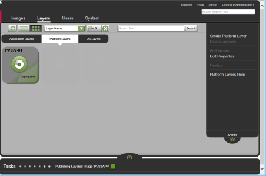
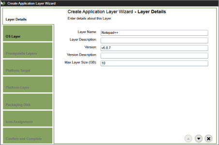

You are here: Learn about Citrix App Layering [UnideskVersion Layering 4.0.8] > Test drive > Publish to PVS, XenApp 7 in vSphere
#Test drive: Publish to PVS, XenApp 7 in vSphere
In this article:
<table>            <col></col>            <tbody>                <tr>                    <td>                        
<a href="#Platform"> Platforms used in this test drive</a>                        
                        
<a href="#Componen"> Components you will create</a>                        
                        
<a href="#Prerequi"> Prerequisites</a>                        
                        
<a href="#Part"> Publish a test image with an OSLayer and a Platform Layer</a>                        
                        
<a href="#Part2"> Add your first App Layer and republish the Layered Image</a>                        
                    </td>                </tr>            </tbody>        </table>
##Platforms used in this test drive
<table>            <col></col>            <col></col>            <tbody>                <tr>                    <td>Create Layers in:</td>                    <td> vSphere</td>                </tr>                <tr>                    <td>Publish Layered Images to:</td>                    <td>PVS</td>                </tr>                <tr>                    <td>For delivery to: </td>                    <td>XenApp users</td>                </tr>            </tbody>        </table>
This test drive leads you through the process of publishing a Layered Image as a vDisk to a PVS server. As this diagram shows, the hypervisor in this scenario is vSphere, and the connection broker is Citrix XenApp. 

##Components you will create
<table>            <col></col>            <col></col>            <tbody>                <tr>                    <th>Component</th>                    <th>Description</th>                </tr>                <tr>                    <td>OSLayer</td>                    <td>                        <ul>                            <li>Contains Windows Server 2012 R2 </li>                            <li>Unidesk Tools are installed</li>                            <li>Network card is set to VMXNet3</li>                        </ul>                    </td>                </tr>                <tr>                    <td>Platform Layer</td>                    <td>                        <ul>                            <li>Layer containing all platform-related software and settings</li>                            <li>Created in vSphere using a VMware VM for the Packaging Machine</li>                        </ul>                    </td>                </tr>                <tr>                    <td>App Layer</td>                    <td>                        <ul>                            <li>Notepad++</li>                        </ul>                    </td>                </tr>                <tr>                    <td>Image Template</td>                    <td>                        <ul>                            <li>Created in two stages:<ul><li> Stage 1: Includes OS Layer ; Platform Layer</li><li>Stage 2: Includes the addition of App Layer </li></ul></li>                        </ul>                    </td>                </tr>                <tr>                    <td>Layered Image</td>                    <td>                        <ul>                            <li>Image Template</li>                            <li>OS Layer</li>                            <li>Platform Layer</li>                            <li>App Layer</li>                        </ul>                    </td>                </tr>                <tr>                    <td>PVSvDisk</td>                    <td>                        <ul>                            <li>Contains the Unidesk Layered Image</li>                        </ul>                    </td>                </tr>            </tbody>        </table>
##Prerequisites
<table>            <col></col>            <col></col>            <tbody>                <tr>                    <td>                        <h3>Unidesk</h3>                        
o Unidesk ELMinstalled on a server in your vSphere environment.
                        
o Unidesk Tools downloaded from the Unidesk Download page and copied to a location that the Packaging Machine VM will be able to access.
                        <h3>vSphere</h3>                        
o Access from the Packaging Machine VM in vSphere to the Unidesk Tools download, which is available on the Unidesk Download page.
                        
o vSphere resource information for Unidesk <a href="connector_config_fields3_vs4.htm">vSphere Connector Configuration</a>.
                        <h3>Citrix XenApp </h3>                        
o XenApp Virtual Delivery Agent Installer for Windows Server OS. The XenApp version must match the version of the XenApp server on which the Layered Image will be used.
                    </td>                    <td>                        <h3>PVS</h3>                        
o Unidesk Agent - Installed on all PVS servers used to access the PVS servers to which you will publish images. (Agent must be registered with the Unidesk ELM.)
                        
o All PVSservers where the Unidesk Agent is installed must have the PVSConsole installed. 
                        
o PVS Target Device Imaging software (version must match the PVS server to which the Layered Image will be published).
                        
o PVSresource information for the Unidesk <a href="connector_config_fields_pv4.htm">PVS Connector Configuration</a>. 
                        
o Appropriate PowerShell Snap-in must be installed.
                        
o When using KMS licensing, PVS requires that each target device has a unique CMID. For more about this, see the Citrix article, <a href="https://www.citrix.com/blogs/2014/05/01/demystifying-kms-and-provisioning-services/">Demystifying KMS and Provisioning Services</a>. The steps for rearming KMS are covered in the <a href="#Step3_platform_pulishing">Platform Layer instructions</a> below.
                    </td>                </tr>            </tbody>        </table>
##Publish a test image with an OS##Layer and a Platform Layer
In this part of the test drive you will:
<table>            <col></col>            <tbody>                <tr>                    <td>                        
<a href="#Step"> Step 1: Create an OSLayer</a>                        
                        
<a href="#Step3_platform_pulishing"> Step 2: Create a Platform Layer to include in Layered Images</a>                        
                        
<a href="#Step4_template"> Step 3: Create an Image Template</a>                        
                        
<a href="#Step5_publish"> Step 4: Publish a Layered Image to PVS</a>                        
                        
<a href="#Step6_provision"> Step 5: Assign the new vDisk to a collection</a>                        
                    </td>                </tr>            </tbody>        </table>
###Step 1: Create an OS###Layer

In this step you will create a vSphere VM to use as your OSMachine, and prepare the OS on it. Then you will download the OS.vmdk file to the Network File Share and import the OS Disk into the Unidesk OSLayer.
<ol>            <li>                
In vSphere, create a Windows Server 2012 R2 VM, specifying a network adaptor of VMXNet3.
                
<b>Important:</b> When creating the image, be sure to choose the default cluster allocation size of 4K.
            </li>            <li>Log into the new VM.</li>            <li>Check to see if the operating system is configured with a VMXNet3 card, and if not, change the setting to VMXNet3. Then restart the system and ensure the new network adapter setting is working.</li>            <li>Install Windows Server 2012 <b>Session Host role</b>.</li>            <li>Download the Unidesk OS Machine Tools from the Unidesk Support Download Center. </li>            <li>Double-click the executable to copy the scripts and files to <code>C:\Windows\Setup\scripts</code>.  </li>            <li>From the <code>C:\Windows\Setup\scripts</code> folder, run the included Setup_x64.exe file on the VM to install the Unidesk tools.</li>            <li>Shut down the VM. </li>            <li>Right-click the VM and select <b>Template > Export OVF Template</b>. This preserves any snapshots you may have made.</li>            <li>In the wizard that opens, select the name of the file that will be created, and the directory in which you would like to store the file and format: "Folder of files (OVF)". Files are downloaded to the Network File Share.</li>            <li>In the Unidesk ELM, select <b>Layers > OS Layers</b> and click <b>Create OS Layer</b>. This opens the Create OS Layer Wizard so you can set up the new Layer and import your operating system into it.</li>            <li>First, specify a <b>Layer Name</b> and <b>Version</b> in the Layer Details tab. </li>            <li>In the Connector tab, select the <b>Network File Share</b> where you downloaded the vSphere .vmdk files. Once connected to the file share, you can select the operating system to import.</li>            <li>In the OS Disk Details tab, click <b>Browse</b> to select the  *.vmdk file. </li>            <li>In the Icon Assignment tab, select the 2012 icon for this Layer.</li>            <li>In the Confirm and Complete tab, make sure the details of the OS Layer are correct, and click <b>Create Layer</b>. </li>        </ol>
When the task completes, the new OS Layer in the Unidesk Management Console (UMC) displays a Deployable status.
###Step 2: Create a Platform Layer to include in Layered Images
[Platform Layers contain the software and settings required to either:](Resources/Images/scenario_platform_layer.png)
<ul>            <li>Create other Layers in your hypervisor environment, or </li>            <li>Publish and run your Layered Images in the target environment</li>        </ul>
By putting all platform-specific software and settings into Platform Layers, your other Layers and Image Templates are free of any platform-specific software, and can be used to create Layered Images for multiple environments. 
Now you will create a Platform Layer to use in your Layered Images. This Platform Layer helps to ensure that Layered Images run correctly in your environment. 
For this test drive, the platform software and settings you will include in the Platform Layer are for vSphere, PVS, and XenApp. Using the Create Platform Layer wizard in the UMC, you will:
<ul>            <li>Deploy a Packaging Machine in vSphere. </li>            <li>Install the platform software, configure platform settings, and verify the Layer.</li>            <li>Rearm KMS (assuming your OS image was activated using KMS).   </li>            <li>Finalize the Platform Layer by importing the Packaging Machine. </li>        </ul>
Here's how:
<ol>            <li>Select <b>Layers >Platform Layers</b> and then  <b>Create Platform Layer</b> from the Action bar to open the Create Platform Layer wizard.</li>            <li>On the Layer Details tab, enter a <b>Layer Name</b> and <b>Version</b>, both required values.</li>            <li>On the OSLayer tab, select the OSLayer you created earlier. </li>            <li>On the Connector tab, click <b>New</b> to add a vSphere Connector Configuration for creating the Packaging Machine VM. Use the <a href="connector_config_fields3_vs4.htm">prerequisite</a> vSphere Connector Configuration <a href="connector_config_fields3_vs4.htm">information</a> to complete the fields. Click <b>TEST</b>to verify the connection, then click <b>SAVE</b>.</li>            <li>                
On the Platform Types tab, select <b>This platform layer will be used for publishing Layered Images</b>, and select the hypervisor, Provisioning Service, and Connection Broker where you will publish your Layered Images.
                
<a href="Resources/Images/layers_platform_pvs.png"></img></a>                
            </li>            <li>On the Packaging Disk tab, notice the Packaging Disk  <b>File name</b>. This disk will be used for the Packaging Machine (the VM)where you will install the platform tools and configure the settings.</li>            <li>In the Icon Assignment tab, select one of the default icons.</li>            <li>In theConfirm and Complete tab, review the settings and click <b>Create Layer</b>. </li>            <li>                
Expand the Tasks bar at the bottom of the UI, and double-click the Packaging Disk task to show the full task description. Once the Packaging Disk has been created, the Task bar displays the location of the Packaging Disk in your environment. Example:
                
<a href="Resources/Images/scenario_layer_task_vs.png"></img></a>                
            </li>            <li>                
Log into your vSphere web client, then use the information displayed in the Create Platform Layer Task (shown above) to navigate to the Packaging Machine in vSphere.
            </li>            <li>                
Power on the Packaging Machine, and remote log into it. Remote log into the Packaging Machine with the User account you used to create the operatingsystem.
            </li>            <li>                
Domain join the Packaging Machine VM.
            </li>            <li>                
Install your vmTools, and configure the vSphere settings as you want them to be when the Packaging Machine starts.
            </li>            <li>                
Run the PVS Target Device Installation software. In the installation wizard, take the default settings, except on the last page of the wizard, deselect the Launch Imaging Wizard checkbox. 
                
<b>Important:</b> Do not run the device Imaging Wizard.
            </li>            <li>                
Run the PVS Device optimization tool.
            </li>            <li>                
Install the XenApp Virtual Delivery Agent for Windows Server OS using the default settings. For the Master device option, choose MCS/PVS.
            </li>            <li>                
Verify the Rearm count on the OS by running slmgr /dlv from a command prompt. 
<pre>slmgr /dlv</pre>            </li>            <li>                
Rearm KMS:
<pre>slmgr /rearm</pre>            </li>            <li>                
Double-click the <i>Shutdown For Finalize</i> icon. A command line window displays messages about the layer verification process. If there is an outstanding operation, wait for it to complete. 
                
                    </img>                
            </li>            <li>Once any pending operations are complete, if the Finalize process tells you to reboot the machine, be sure to rearm KMS again.</li>            <li>Shut down the Packaging Machine by double-clicking the <i>Shutdown For Finalize</i> icon again. </li>            <li>Return to the UMC, and select <b>Layers > Platform Layers</b>, then select the Platform Layer and click <b>Finalize</b>.</li>            <li>Use the Task bar to monitor when the layer becomes deployable. </li>        </ol>
When the new task becomes Deployable, you can add your new layers to an Image Template. 
###Step 3: Create an Image Template

Create an Image Template that includes the same OS Layer as you used in the Platform Layer you just created.
<ol>            <li>Select <b>Images</b> and click <b>Create Template</b>. The Create Template Wizard opens.</li>            <li>Type a name for the template and select an icon for the Layer.</li>            <li>In the OSLayer tab choose the OS Layer.</li>            <li>Skip the App Layer Assignment tab for now. You'll add App Layers in the next part of this test drive.</li>            <li>On the Connector tab, select the PVS Connector Configuration. If you don't have one yet, click <b>New</b> to open the Citrix PVSConnector Configuration page, and enter the information, as described <a href="connector_config_fields_pv4.htm">here</a>.</li>            <li>On the Platform Layer tab, select the Platform Layer that contains the PVS and XenApp software and settings.</li>            <li>On the Layered Image Disk tab, edit the Layered Image Disk Filename, and keep the default values for the rest of the settings.</li>            <li>On the Confirm and Complete tab, click <b>Create Template</b>. </li>        </ol>
Next, you can publish the Layered Image using this template.
###Step 4: Publish a Layered Image to PVS
<ol>            <li>Select <b>Images</b>. Your Template is displayed.</li>            <li>Select the Template and click <b>Publish Layered Image</b>. This opens the Publish Layered Image wizard.</li>            <li>Confirm and complete the wizard, then expand the Task bar at the bottom of the window and monitor the task. When the task is <i>Done</i>, the vDisk is ready to add to a collection. </li>        </ol>
###Step 5: Assign the new vDisk to a collection
<ol>            <li>Access the target PVS server via the PVSConsole. The new vDisk should appear under the targeted PVS store (refresh may be required).</li>            <li>Test the new vDisk by assigning it to a device.</li>            <li>Using Citrix PVSbest practices, assign the new vDisk to a collection of targeted devices. </li>        </ol>
Now that you have tested your Layered Image in PVS, it's time to add an App Layer to the image. 
##Add your first App Layer and republish the Layered Image
In this part of the test drive you will:
<table>            <col></col>            <tbody>                <tr>                    <td>                        
<a href="#Step1_platform_packaging"> Step 1: Create a Platform Layer for packaging other layers</a>                        
                        
<a href="#Step6"> Step 2: Create an App Layer</a>                        
                        
<a href="#Step7"> Step 3: Publish a new Layered Image containing the new App Layer</a>                        
                    </td>                </tr>            </tbody>        </table>
Similar to the process for creating a Platform Layer, you will prepare an App Layer in the UMC, deploy a Packaging Machine VM in vSphere where you install Notepad++, then import the VM into the new layer. You will add this layer to your Image Template, and publish a new version of the Layered Image.
###Step 1: Create a Platform Layer for packaging other layers

The Platform Layer for packaging layers is where you install the tools and settings specific to a particular hypervisor. Putting platform-specific software on the Platform Layer means that your App Layers do not need to include it, and therefore can be used on multiple platforms. 
Using the UMC, you will prepare this layer and deploy a Packaging Machine VM in vSphere. On the Packaging Machine, you will install the hypervisor software and configure the hypervisor settings, as needed. Finally, you will import the Packaging Machine to create the Platform Layer for packaging layers. 
<ol>            <li>Select <b>Layers >Platform Layers</b> and then  <b>Create Platform Layer</b> from the Action bar to open the Create Platform Layer wizard.</li>            <li>In the Layer Details tab, enter a <b>Layer Name</b> and <b>Version</b>, both required values.</li>            <li>In the OSLayer tab, select the OSLayer you created earlier. </li>            <li>In the Connector tab, the <b>vSphere</b> Connector Configuration.</li>            <li>On the Packaging Disk tab, notice the Packaging Disk  <b>File name</b>. This disk will be used for the Packaging Machine (the VM)where you will install the platform tools and configure the settings.</li>            <li>In the Icon Assignment tab, select one of the default icons.</li>            <li>In theConfirm and Complete tab, review the settings and click <b>Create Layer</b>. </li>            <li>                
Expand the Tasks bar at the bottom of the UI, and double-click the Packaging Disk task to show the full task description. Once the Packaging Disk has been created, the Task bar displays the location of the Packaging Disk in your environment. Example:
                
<a href="Resources/Images/layers_app_action_required_vs.png"></img></a>                
            </li>            <li>                
Log into your vSphere web client, then use the information displayed in the Packaging Disk Task (shown above) to navigate to the Packaging Machine in vSphere.
            </li>            <li>                
Power on the Packaging Machine, and remote log into it. Remote log in to the Packaging Machine with the User account you used to create the operatingsystem.
            </li>            <li>                
Domain join the Packaging Machine VM.
            </li>            <li>                
Install your vmTools, and configure the vSphere settings as you want them to be when the Packaging Machine for this layer starts.
            </li>            <li>                
Double-click the <i>Shutdown For Finalize</i> icon. A command line window displays messages about the layer verification process. If there is an outstanding operation, wait for it to complete. 
                
                    </img>                
            </li>            <li>Once any pending operations are complete, shut down the Packaging Machine by double-clicking the <i>Shutdown For Finalize</i> icon again. </li>            <li>Return to the UMC, and select <b>Layers > Platform Layers</b>, then select the Platform Layer and click <b>Finalize</b>.</li>            <li>Use the Task bar to monitor when the layer becomes deployable. </li>        </ol>
###Step 2: Create an App Layer

<ol>            <li>Select <b>Layers >App Layers</b> and then  <b>Create App Layer</b> from the Action bar to open the Create App Layer wizard.</li>            <li>In the Layer Details tab, enter a <b>Layer Name</b> and <b>Version</b>, both required values.</li>            <li>In the OSLayer tab, select the OSLayer you created earlier. </li>            <li>In the Connector tab, choose the vSphere <b>Connector Configuration</b> you used to create the Platform Layer for packaging other layers.</li>            <li>On the Platform Layer tab, choose the Platform Layer you just created.</li>            <li>On the Packaging Disk tab, enter a <b>File name</b> for the Packaging Disk. This disk will be used for the Packaging Machine (the VM)where you will install the application.</li>            <li>In the Icon Assignment tab, select one of the supplied icons for the layer, or if you'd like to use the application icon, you can browse for it and import it into this tab.</li>            <li>In theConfirm and Complete tab, review the settings and click <b>Create Layer</b>. </li>            <li>                
Expand the Tasks bar at the bottom of the UI, and double-click the task to expand it. Once complete, the Task bar displays the location of the Packaging Disk or Machine in your environment.
                
<a href="Resources/Images/layers_app_action_required_vs.png"></img></a>                
            </li>            <li>Log into your vSphere web client, then use the information displayed in the above Task to navigate to the Packaging Machine in vSphere.</li>            <li>Power on the Packaging Machine, and remote log into it. Remote log in to the Packaging Machine with the User account you used to create the operatingsystem in vSphere.</li>            <li>Install the application, leaving the application and the Packaging Machine in the state you want it to be for the user.</li>            <li>                
Double-click the <i>Shutdown For Finalize</i> icon. A command line window displays messages about the layer verification process. 
                
                    </img>                
            </li>            <li>If there is an outstanding operation that must be completed before the Layer can be finalized, you are prompted to expedite the process. For example, if a Microsoft NGen operation needs to complete, you may be able to expedite the NGen operation, as detailed <a href="layer_apps_create_vs4.htm"><a href="layer_about_co4.htm#Verifyin">here</a></a>.</li>            <li>Once any pending operations are complete, shut down the Packaging Machine by double-clicking the <i>Shutdown For Finalize</i> icon again. </li>            <li>Return to the UMC, and select <b>Layers > App Layers</b>, and select <b>Finalize</b> in the Action bar.</li>            <li>Use the Task bar to monitor when the layer becomes deployable. </li>        </ol>
Once the App Layer task is marked Deployable, you can add the new App Layer to your Image Template. 
###Step 3: Publish a new Layered Image containing the new App Layer
<ol>            <li>Select <b>Images</b>, then select your Image Template and click <b>Edit Template</b>.</li>            <li>In the Edit Template wizard, select the Application Assignment tab and select the <b>Notepad++ Layer</b>. </li>            <li>Skip the Confirm and Complete tab, and click Save Template Changes to save the updated template.</li>            <li>Back in the Images module, select the Template again and click <b>Publish Layered Image</b>. This opens the Publish Layered Image wizard.</li>            <li>Confirm the settings and click <b>Publish Layered Image</b>.</li>            <li>Monitor the tasks for completion.</li>            <li>Once the task is complete, access the target PVS server via the PVS Console. The new vDisk should appear under the targeted PVS store (refresh may be required).</li>            <li>                
Assign the new vDisk either to a new or existing collection.
            </li>        </ol>

