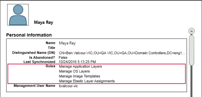

[Set up Unidesk](landing_set_up_co4)
 > Assign Unidesk Roles to users
#Assign Unidesk Roles to users
In this article:
<table>            <col></col>            <tbody>                <tr>                    <td>                        
<a href="#Unidesk"> Unidesk Roles defined</a>                        
                        
<a href="#Assign"> Assign Unidesk Roles to users</a>                        
                        
<a href="#Next"> Next step</a>                        
                    </td>                </tr>            </tbody>        </table>
##About Unidesk users, roles, and rights
###Built-in Administrator account
When you first install the Unidesk ELM (appliance) and log onto the Unidesk Management Console (UMC), there is a "built-in" Administrator account that you can use to get started. This Administrator has the rights to perform all Unidesk operations. You can edit this user's properties, including the name, password, and contact info. Be sure to change the password for this built-in Administrator account as part of installing and configuring the Unidesk ELM. 
### AD###User accounts
Other than the built-in Administrator account, all Unidesk users are actually ADusers imported via one or more directory junctions. Once your directory junction(s) have been created, you can assign Unidesk Roles to each user, as described later in this topic. You can see which roles are assigned to a user in the User Details.

###Unidesk Roles defined
Unidesk Roles determine which Unidesk modules a user can manage. Users assigned one or more Unidesk Roles can log into the UMC, and these users are listed on the Administrators tab (select Users > Administrators). 
Note: When upgrading from Unidesk 4.0.6 or earlier, users assigned the Machine Administrator Role in earlier releases will now be assigned the Read Only Role. If the user needs more than read only access, reconfigure the user roles, as needed. 
###Rights by Role
<table>            <col></col>            <col></col>            <thead>                <tr>                    <th>Role</th>                    <th>Rights </th>                </tr>            </thead>            <tbody>                <tr>                    <td>                        
Administrator
                    </td>                    <td>                        <ul>                            <li>    Can do every operation available in the UMC.      </li>                            <li>Only users assigned the Administrator Role can edit user properties on the Users tab (Select  <b>Users > Users</b>).</li>                            <li>     Only administrators can configure ELM system settings. and manage licenses.</li>                        </ul>                    </td>                </tr>                <tr>                    <td>                        
Manage App Layers
                    </td>                    <td>                        <ul>                            <li>Can create, edit, and delete application layers and versions.</li>                        </ul>                    </td>                </tr>                <tr>                    <td>                        
Manage Elastic Layer Assignments
                    </td>                    <td>                        <ul>                            <li>Can add, update, and remove Elastic layer assignments.</li>                        </ul>                    </td>                </tr>                <tr>                    <td>                        
Manage Image Templates
                    </td>                    <td>                        <ul>                            <li>    Can create, edit and delete Image templates.</li>                            <li>    Can add, update, and remove app layer assignments for image templates.    </li>                            <li>Can update platform layer assignments for image templates.    </li>                            <li>Can update OS layer assignments for image templates.</li>                        </ul>                    </td>                </tr>                <tr>                    <td>                        
Manage OSLayers
                    </td>                    <td>                        <ul>                            <li>Can create, edit, and delete OS layers and versions.</li>                        </ul>                    </td>                </tr>                <tr>                    <td>                        
Manage Platform Layers
                    </td>                    <td>                        <ul>                            <li>Can create, edit, and delete Platform layers and versions.</li>                        </ul>                    </td>                </tr>                <tr>                    <td>                        
Publish Layered Images
                    </td>                    <td>                        <ul>                            <li>    Can publish layered images.    </li>                            <li>Cannot create or modify existing image templates.</li>                        </ul>                    </td>                </tr>                <tr>                    <td>                        
Read Only 
                    </td>                    <td>                        <ul>                            <li>Can view information about any items in the UMC.    </li>                            <li>Cannot launch any wizards or make any changes.    </li>                            <li>The Read Only user cannot cancel any tasks.</li>                        </ul>                    </td>                </tr>            </tbody>        </table>
###User credentials for logging into the UMC
When you assign Unidesk Roles to Directory Service users, they can use their Directory Service credentials to log into the UMC.
###Who can assign Unidesk Roles?
You can change a user's role if you are logged into the UMC as a user assigned the Administrator Role.  
##Assign Unidesk Roles to users
<ol>            <li>Log into the UMC.</li>            <li>Select <b>Users > Users</b>.</li>            <li> Select a user and click Edit Properties. This opens the Edit User wizard. </li>            <li>                
Skip to the Roles tab, and select one or more roles for this user. For details, see <i>Rights by Role</i> above.
                
<a href="Resources/Images/user_roles_wizard.PNG"></img></a>                
            </li>            <li>In the Confirm and Complete tab, click Update User. Any comments you enter will appear in the  Information view Audit History.</li>        </ol>
##Next step
[Create Layers](landing_layer_co4)
